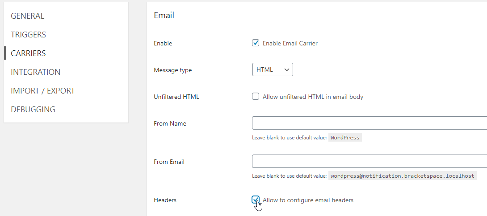

# How to setup different FROM address for different Notifications

## Enable Email Headers

Make sure that you can setup the email headers. Go to Notification -> Settings -> Carriers -> Email and check the **Allow to configure email headers** checkbox.



## Configure the FROM Header

On the specific Notification screen add new `From` header with value in format

```
From Name <from@email.com>
```

.png>)
