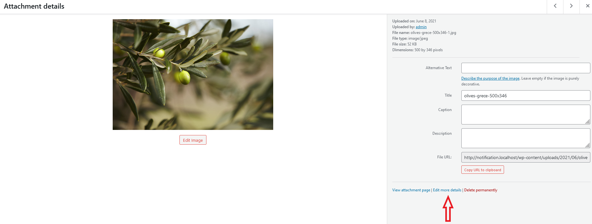
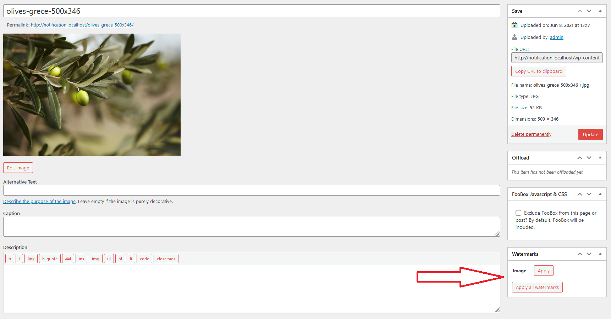
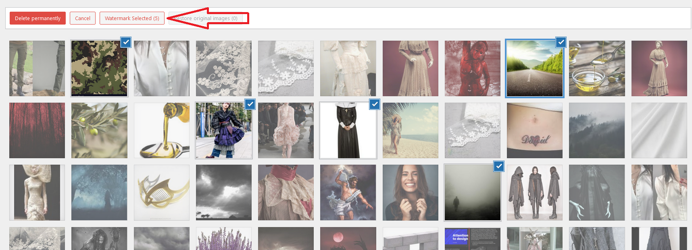
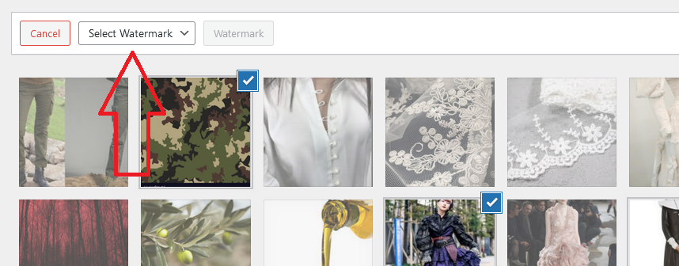
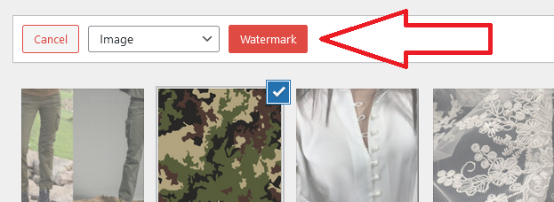
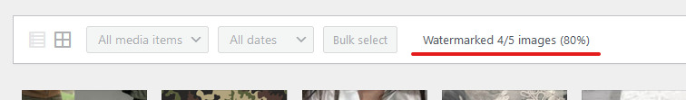

# Applying Watermark

## If you want to watermark just one image:

1. Go to the Media Library

2. Click on the chosen image to open the Attachment details page

3. Go to "Edit more details"

4. Apply your watermark(s) using buttons in the Watermark box

5. Update your image

## If you want to watermark few chosen images:

1. Go to the Media Library

2. Click the "Bulk select" button

3. Choose images you want to watermark

4. Click the "Watermark Selected" button

5. Select a watermark you want to apply

6. Apply by clicking the "Watermark" button

7. Wait for your watermark to be applied on all chosen images

