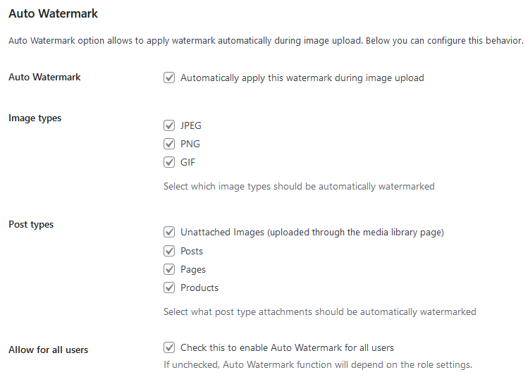
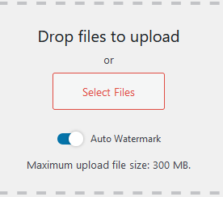

# Common issues

## Watermark has been applied to the image but is not showing on the front-end.

There are a few steps that you can do to try to solve the problem:

1. Make sure you refreshed the page cache (via plugin or in your server panel).
2. Make sure you marked on the watermark edit page all the image sizes that you expect to be watermarked on the front-end.
3. Check if other plugins you use don't cache your images already before they are watermarked. This might include CDN or other image processing plugins.

## Image watermark is displayed with a black background when added as a PNG with transparency.

Whenever there is a problem with transparency, make sure the PNG is saved in 16 bits.

The problem may be also connected with the version of the GD library installed on the server, which has a bug and cannot cope with transparency. In this case, the best solution would be to ask your hosting provider to make an update or you can try to upgrade the PHP version to the higher one which should be bundled with a newer version of GD.

## Plugin adding query strings to images - why and how to turn this off?

```
?v=1626777211
```

This is the version parameter. It is static, it changes when something in a given image changes (the watermark is added, backup restored).

These strings are being added to the image URL to bust the caching. It should prevent browsers from using cached images when they needed to be refreshed. Without this option turned on a browser might display the original image which was cached before instead of the watermarked one.

Since some users had a problem with this version parameter feature, we added an option to disable "Cache busting" in the Easy Watermark settings. However, consider turning it off only if it causes problems in your environment (e.g. images do not show at all).

## I cannot restore an image

See how to manually restore your image - it's been explained in the [FAQ](/easy-watermark/user-guide/faq#how-to-manually-restore-images).

## I cannot choose an image/text watermark - it's grayed out

That's because, in the current free plugin version, you can only add one image watermark and/or one text watermark. Once you add a watermark of the first type, this option is grayed out for your second watermark, as you can only use the second type of watermark then.

## Auto Watermark switch is set to ON during the images upload, but no watermarks are applied

Let us explain first what is the Auto Watermark feature and what is the Auto Watermark switch.

The Auto Watermark feature lets you have your images watermarked automatically during upload. You can define whether you want to enable this feature or not, for each watermark separately on their edit page. You can also define image or post types for which the Auto Watermark feature should work.



Then there is a switch available during images upload, that lets you decide if any of the previously set Auto Watermark feature's behavior is supposed to happen on this specific image(s) upload. This option is set to ON by default.



1. If you turn it OFF, the Auto Watermark feature won't work at all on this image(s) upload, no matter what are each watermark settings. In other words, the part of the code responsible for the Auto Watermark feature behavior won't be executed at all during this particular image(s) upload.
2. If you leave it ON, the Auto Watermark feature's code will be executed, which means checking each watermark's settings and applying (only) watermarks that have this feature enabled for current image and post types.

That means, that the Auto Watermark switch, set to ON during image upload, may do nothing in some cases. For example:

* when you don't have any watermarks defined yet
* when all your defined watermarks have Auto Watermark feature disabled
* when you upload an image in the format that was not chosen in the watermark's Auto Watermark settings

The feature's code will be executed, just no watermarks will be qualified to be applied.