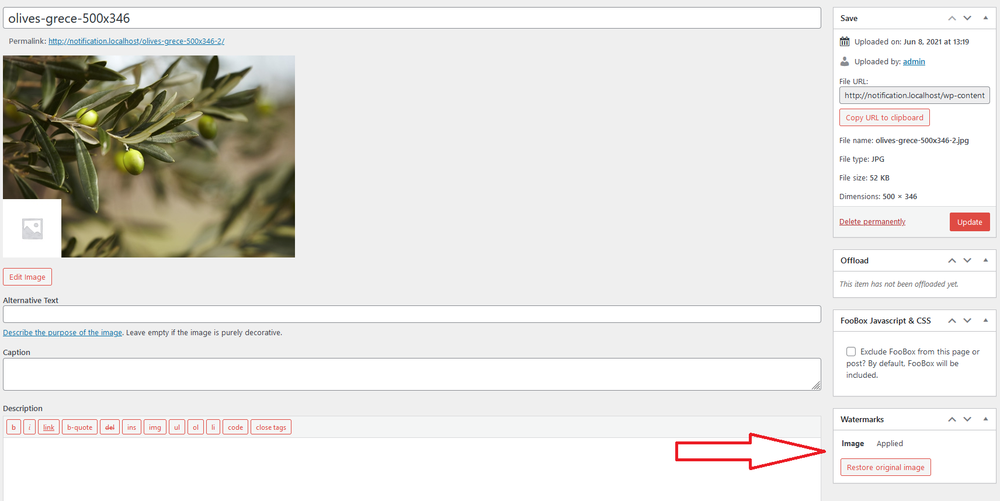
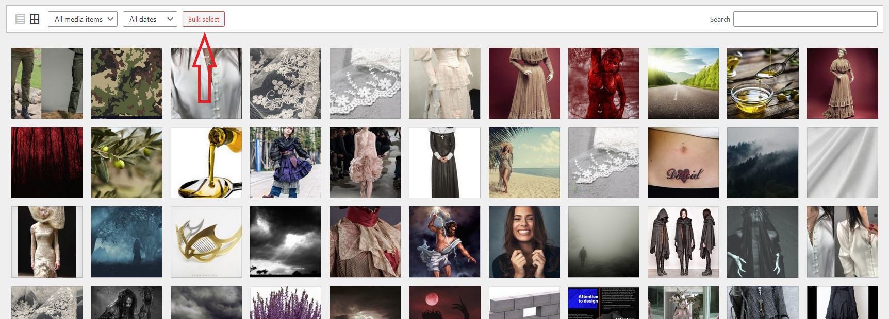
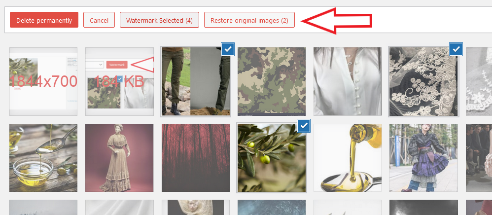
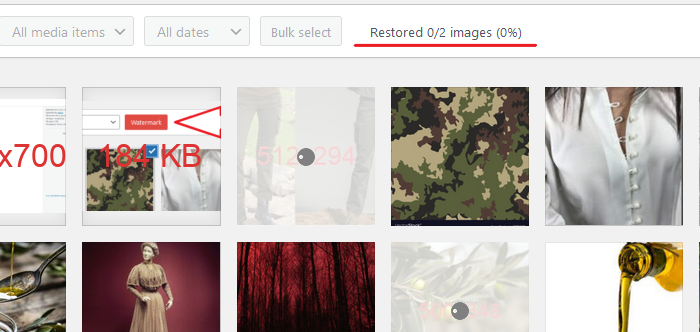

# Removing Watermark

## If you want to remove the watermark from one specific image:

1. Go to the Media Library

2. Click on the chosen image to open the Attachment details page

3. Go to "Edit more details"

4. Restore your image using the button in the Watermark box

## If you want to remove the watermark from few chosen images:

1. Go to the Media Library

2. Click the "Bulk select" button

3. Choose images you want to restore

4. Click the "Restore original images" button

5. Wait for your images to be restored

