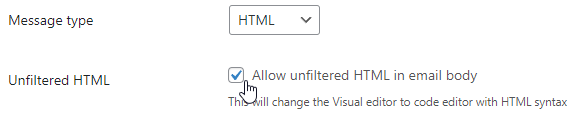

# How to send HTML Emails

In order to use HTML, you need to change one option in the plugin Settings.

In Settings -> Carriers -> Email, make sure the Message type is set to HTML and Unfiltered HTML checkbox i checked.

This will enable a code editor on the  Notification edit page where you'll be able to use HTML.
