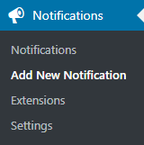

# How to Create WordPress Notifications - Complete Setup Guide

**Creating WordPress notifications** allows you to automate communication and integrate your site with external services. This step-by-step guide shows you how to install the Notification plugin, configure triggers, and set up automated email alerts, webhooks, and other notification types.

Whether you need to notify administrators of user registrations, send welcome emails, or integrate with third-party services, this tutorial covers everything needed to create effective WordPress notification workflows.

## Install the WordPress Notification Plugin

:::tip
If you already have the plugin installed, [skip this section](#create-your-first-wordpress-notification)
:::

The Notification plugin can be downloaded from [official WordPress repository](https://wordpress.org/plugins/notification/). That means you can search for it in your WordPress dashboard.

Then you just have to activate it and you are all set!

## Create Your First WordPress Notification

After plugin installation, you'll find the `Notifications` menu in your WordPress dashboard. Click `Add New Notification` to start creating your automated notification workflow.

Configure your WordPress notification by:

1. **Adding a descriptive title** (for internal organization only)
2. **Selecting a trigger** (the WordPress event that starts the notification)
3. **Configuring carriers** (how and where the notification is sent)
4. **Using merge tags** (dynamic content placeholders)

### Understanding Notification Components

Each WordPress notification consists of three core elements:

- **Triggers**: WordPress events like user registration, post publication, or comment submission
- **Carriers**: Delivery methods such as email, webhook, Slack, or SMS
- **Merge Tags**: Dynamic placeholders that insert real-time data like `{user_email}` or `{post_title}`

For detailed information about how these components work together, see:

[How WordPress Notification plugin works](how-notification-plugin-works.md)