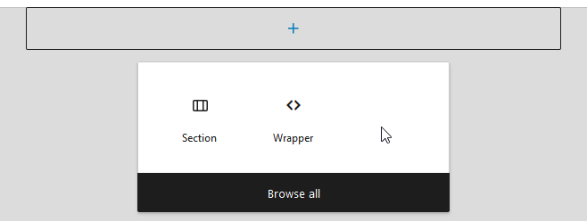

# Creating New Template

**Creating beautiful email templates in WordPress** has never been easier with Pretty Email's visual template builder. You can start with professional presets or build completely custom email designs from scratch.

To create a new Pretty Email template:

1. Go to `Appearance` -> `Pretty Email`

   

2. Click `Add New Template`

   

3. You can choose from one of available preset templates to start with

   

4. Or build the new one from scratch

   

5. You can change your template name in `Settings` sidebar

:::note
The template name is only visible to website administrators, it's not used anywhere in the sent email.
:::

### Sending Template Preview

You can send a preview of your template to your chosen email address, to see how it looks in your real email client (see `Preview` box at the bottom of the `Settings` sidebar)

:::note
See [Global Template Settings](global-template-settings/index.md) and [Composing Templates with Blocks](composing-templates-with-blocks.md) to learn how to put together beautiful templates.
:::