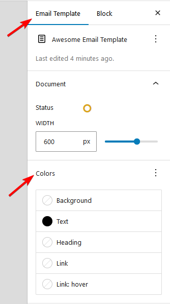

# Colors

**Email template color customization** in Pretty Email lets you create consistent branding across all your email communications. Set default colors for key elements that will be applied throughout your template design.

For each template, you can set the color scheme that will be used throughout this template.

Go to `Email Template` tab in the template edit page view, and to the `Colors` section:

Here you can select default color for each of 5 elements on the template.

:::note
Texts and Headings colors can always be overwritten by more specific settings inside the Text blocks.
:::