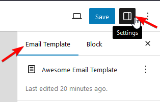
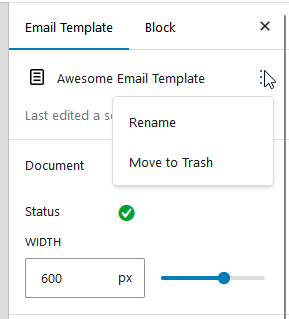

# Global Template Settings

**Global template settings in Pretty Email** allow you to configure default styles and options that apply across your entire email template. These settings ensure consistent branding and design throughout your email communications.

For each template, you can set global settings that will be used throughout this template.

Go to `Settings` sidebar and to the `Email Template` tab

Right at the top you'll find your template name, followed by template status and width settings

:::note
Setting the Width will determine the template main container width (width of all blocks inside it). The background will still be full-width.
:::