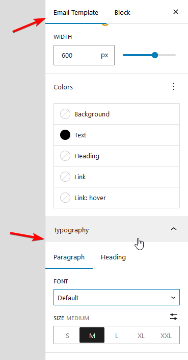

# Typography

**Email typography settings** in Pretty Email help you create consistent, professional text styling across your email templates. Configure fonts, sizes, and text styles that work reliably across different email clients.

For each template, you can set the typography that will be used throughout this template.

Go to `Email Template` tab in the template edit page view, and scroll down to the `Typography` section:

There, you can choose font family and font size for each`Paragraph` and `Heading` tabs separately.

:::note
Paragraph settings will affect all texts in the template unless other, more specific settings are applied.
:::

That means that `Paragraph` settings will be reflected in the typography of all the buttons and lists unless overwritten in specific instances.

`Paragraph` settings will also apply to headings if global `Heading` settings are reset. Setting up global `Heading` styles will ensure that headings are no longer bound to any `Paragraph` settings.

Both `Paragraph` and `Heading` settings can be overwritten in the Text block, and then in each Heading, Text, and List block. Styles will be cascaded as in CSS.

### Custom Fonts

Fonts available in Email Templates depend on the Theme that you use on your website.

Using Full Site Editing Theme gives you the opportunity to upload your own fonts, which will also become available in Email templates.

However, the **rendering of the specific font in the actual email depends on the email client** and is not widely supported.

**List of fonts safe to use for most email clients:**

* Arial (sans-serif)
* Verdana (sans-serif)
* Tahoma (sans-serif)
* Trebuchet MS (sans-serif)
* Times New Roman (serif)
* Georgia (serif)
* Garamond (serif)
* Courier New (monospace)
* Brush Script MT (cursive)