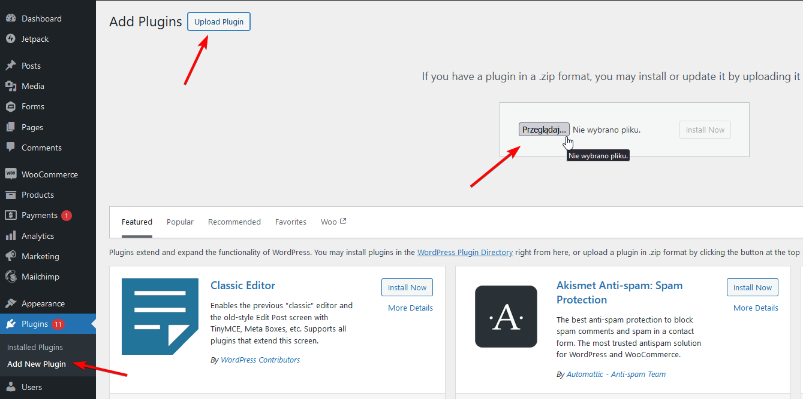
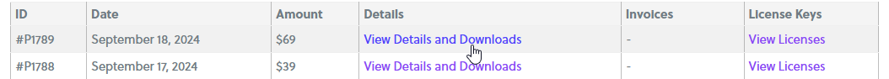
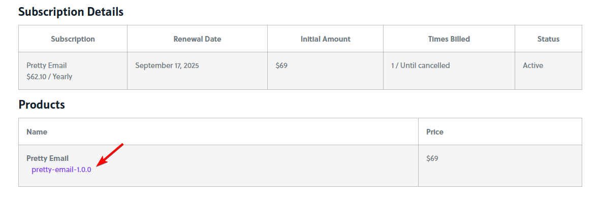
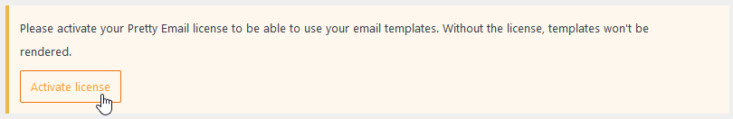
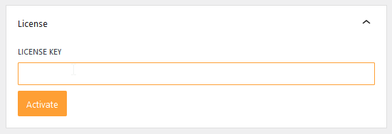

# Installation and License

### Installation

Pretty Email is available in the licensed version only, so you need to [buy access](https://bracketspace.com/downloads/pretty-email/) and download a `.zip`file to install it on your WordPress site.

If you already have your `.zip` file, upload it in the `Plugins` -> `Add New Plugin` -> `Upload Plugin`, and then activate the plugin. Otherwise, see [How to Download Plugin](#how-to-download-plugin).

#### How to Download Plugin

1. Go to [https://stage.bracketspace.com/my-account/payments/](https://stage.bracketspace.com/my-account/payments/)
2. Go to `View Details and Downloads` of your Pretty Email plugin payment

   
3. You'll find a plugin download link in the `Products` table.

   
4. Upload the `.zip` file as described above in [Installation](#installation).

### License

Once you have installed and activated the plugin, go to the plugin's settings to provide a license key. Without it, the templates will not be rendered, so you will not be able to use them.

1. Go to `Appearance` -> `Pretty Email`

2. Navigate to `Settings` tab

   

   Or use the link in the notice.

   
3. Provide your license key in the `License` box.

   

#### Where to find a license key

You can find your license key on your [BracketSpace account page](https://bracketspace.com/my-account/payments/) (`View Licenses` -> `Manage Sites`).