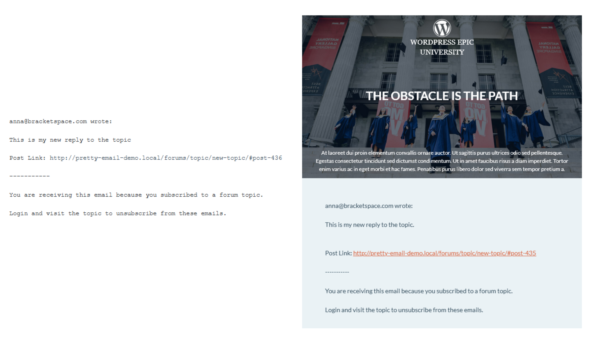
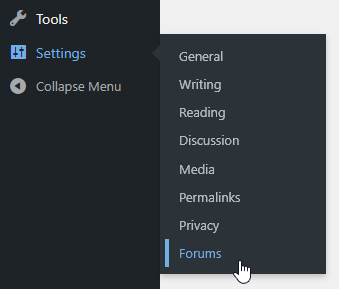
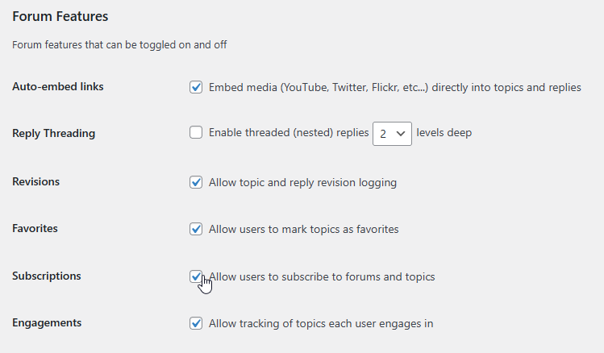
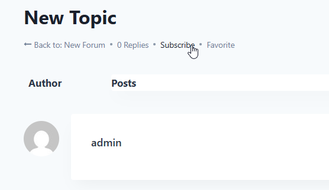
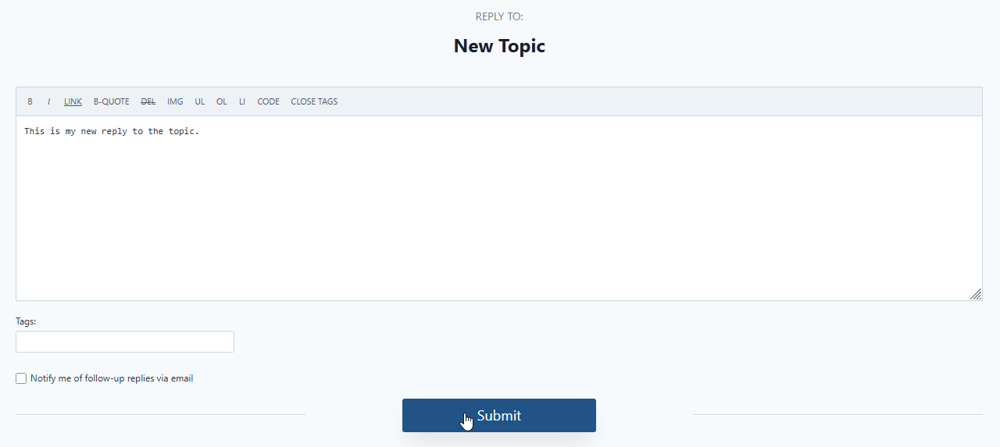
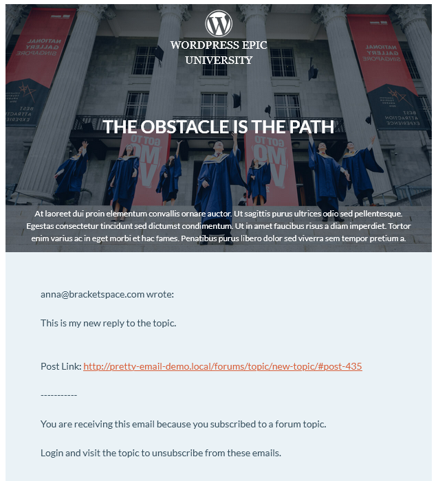

# bbPress

**Forum notification enhancement** transforms how your community engages with discussions. Pretty Email integration with bbPress elevates standard forum alerts into visually appealing, on-brand communications that encourage participation and strengthen community connections.

:::tip Quick Setup
Upgrade your bbPress forum notifications in just **6 minutes** with our straightforward configuration process below. No technical knowledge required!
:::

## Prerequisites

Before integrating Pretty Email with your bbPress forums, ensure you have:

- **bbPress** plugin installed and active on your WordPress site
- **Pretty Email** plugin installed and active ([Setup Guide](../installation-and-license.md))
- WordPress 5.0+ with PHP 7.4 or higher
- At least one forum created in your bbPress installation

:::info New to Pretty Email?
[Download Pretty Email](https://bracketspace.com/downloads/pretty-email/) and start creating professional forum email notifications today.
:::

## Step-by-Step Integration Guide

### 1. Enable Pretty Email for WordPress Notifications

Start by activating Pretty Email to handle WordPress system emails (which includes bbPress notifications):

1. Go to **Appearance** → **Pretty Email** in your WordPress admin

   

2. Click the **Settings** tab

   

3. Turn on **WordPress Emails** in the Integrations section

   

### 2. Select Your Email Template

Choose the template design for your forum notifications:

1. In the **Settings** tab, find the **Default Template** dropdown
2. Choose your preferred email template from the list

   

:::note Email Body Block Required
Your chosen template must include an **Email Body block** to display forum notification content properly.
:::

:::warning Template Applies Site-Wide
The WordPress Emails integration applies your selected default template to **all plain text emails** across your WordPress site, not only bbPress notifications. This encompasses emails from WordPress core, plugins, and themes. For per-email-type template customization, explore plugins with dedicated Pretty Email support like Gravity Forms or WooCommerce.
:::

### 3. Enable bbPress Subscriptions

For email notifications to work, subscriptions must be enabled in bbPress:

1. Navigate to **Settings** → **Forums** in your WordPress admin

   

2. Scroll to the **Forum Features** section

   

3. Check the box for **"Allow users to subscribe to forums and topics"**

4. Click **Save Changes** at the bottom of the page

:::info How It Works
Once subscriptions are enabled, forum members can subscribe to individual topics and forums. When new replies or topics are posted, bbPress sends plain text email notifications that Pretty Email automatically formats using your selected template. Users manage their own subscriptions by clicking subscribe/unsubscribe buttons on topics and forums.
:::

### 4. Test Forum Email Notifications

Thorough testing ensures optimal community experience:

1. Subscribe to a test forum or topic

   

2. Create a new topic or reply to trigger notification

   

3. Verify notification email displays correctly with template styling

   

4. Check email rendering on different devices and email clients
5. Test both notification types:
   - New topic notifications (sent to forum subscribers)
   - New reply notifications (sent to topic subscribers)

## Customization Options

### Forum Branding

Create forum emails that reflect your community identity:

- **Community Logo**: Feature your forum or site logo in email headers
- **Brand Colors**: Apply your community's color palette consistently
- **Typography**: Use fonts that match your forum design
- **Layout Options**: Choose template structures that suit your messaging style
- **Footer Content**: Include forum rules, community links, or social media
- **Call-to-Action**: Add prominent buttons to return to discussions

### Template Design

Create custom email templates using our powerful block-based editor:

- Start with preset template patterns or build from scratch
- Combine blocks to create layouts that match your brand
- Customize colors, fonts, and spacing to fit your style
- Learn more in our [template creation guide](../composing-templates/creating-new-template.md)

## Troubleshooting Common Issues

### Forum Notifications Not Received

**Problem**: Forum members aren't receiving Pretty Email formatted notifications.

**Solution**:
1. Verify WordPress Emails integration is enabled in Pretty Email settings
2. Check that bbPress subscriptions are enabled in Settings → Forums → Forum Features
3. Confirm users are actually subscribed to the forum or topic
4. Ensure your hosting supports email sending capabilities
5. Install an SMTP plugin like WP Mail SMTP for reliable delivery
6. Test with different email addresses across various providers

### Plain Text Notifications Instead of Templates

**Problem**: Forum emails arrive without Pretty Email styling.

**Solution**:
1. Confirm your template contains the Email Body block
2. Verify bbPress subscriptions are enabled in Settings → Forums
3. Check WordPress Emails integration is active in Pretty Email
4. Clear all caching (WordPress cache, page cache, object cache)
5. Test with a fresh browser session or incognito mode

### Forum Content Missing from Emails

**Problem**: Topic or reply content doesn't appear in notification emails.

**Solution**:
1. Ensure Email Body block is present and correctly placed in your template
2. Check that forum posts contain actual content (not empty posts)
3. Disable other plugins that might filter bbPress emails (like custom notification plugins)
4. Test with simple, short text content first to rule out character encoding issues
5. Check if you have custom code filtering the `bbp_subscription_mail_message` hook

### Email Design Breaks in Clients

**Problem**: Notifications display incorrectly in some email applications.

**Solution**:
1. Test across popular email clients (Gmail, Outlook, Apple Mail, Yahoo)
2. Simplify template design for better email client compatibility
3. Use web-safe fonts and standard color codes
4. Keep layouts clean with table-based structures
5. Verify mobile responsiveness on actual devices

## Frequently Asked Questions

**Q: Can I use different templates for different forums or notification types?**

A: No. The WordPress Emails integration applies one default template to **all plain text emails** on your WordPress site, including bbPress notifications, WordPress core emails, and emails from other plugins. You cannot assign different templates to specific forums, topics, or notification types.

**Q: Does bbPress have HTML email settings I need to configure?**

A: No. bbPress always sends plain text emails by design - there are no email format settings to configure. This is perfect for Pretty Email integration, as the WordPress Emails integration automatically catches and formats all plain text emails sent through WordPress's `wp_mail()` function, including all bbPress notifications.

**Q: Does this work with bbPress extensions and add-ons?**

A: Yes, Pretty Email processes final email output from bbPress and compatible extensions. Most bbPress add-ons should work correctly, though we recommend testing your specific configuration.

**Q: Will styled emails improve forum engagement?**

A: While Pretty Email improves visual appeal and professionalism, engagement depends on many factors including content quality, community culture, and notification frequency. Professional emails can contribute to better brand perception.

**Q: Can I include forum statistics or featured topics in emails?**

A: Pretty Email templates support custom blocks where you can add static content like community guidelines, featured discussions, or promotional graphics. However, dynamic forum statistics would require custom development.

**Q: How do I preview forum emails before sending to members?**

A: You can preview template designs in the Pretty Email editor. For complete notification testing with actual forum data, use test accounts to subscribe and trigger notifications on test forums.

**Q: Will this affect email deliverability for forum notifications?**

A: Pretty Email handles presentation only and doesn't impact delivery infrastructure. For better deliverability, pair Pretty Email with professional SMTP services like SendGrid or Postmark.

## Related Resources

### Integration Guides
- [WordPress System Emails](wordpress.md) - Platform-wide email customization
- [WooCommerce Templates](woocommerce.md) - E-commerce notification styling
- [Gravity Forms Integration](gravity-forms.md) - Custom form email templates

### Design Resources
- [Creating Custom Templates](../composing-templates/creating-new-template.md) - Build custom email designs
- [Understanding Blocks](../composing-templates/composing-templates-with-blocks.md) - Email component library
- [Global Design Settings](../composing-templates/global-template-settings/index.md) - Brand consistency management

### Support Channel
Questions about bbPress email integration? [Contact our support specialists](mailto:support@bracketspace.com) for personalized assistance with your forum email template setup.

:::tip Community Engagement Strategy
Clear, professional notifications encourage forum participation! Design emails that make discussion content prominent and easy to read. Include clear reply buttons and forum navigation to drive members back to active conversations.
:::
