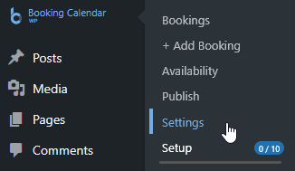
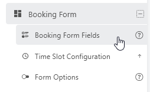
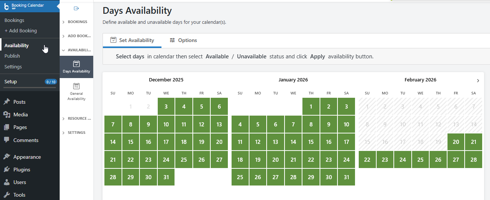
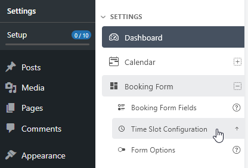
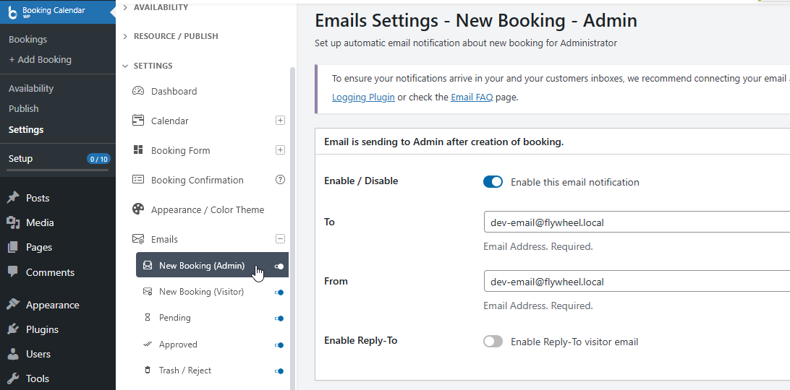
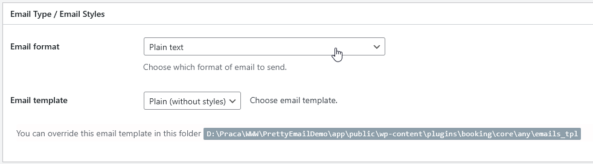
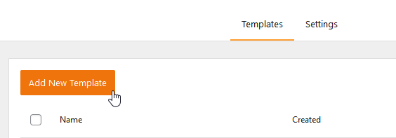
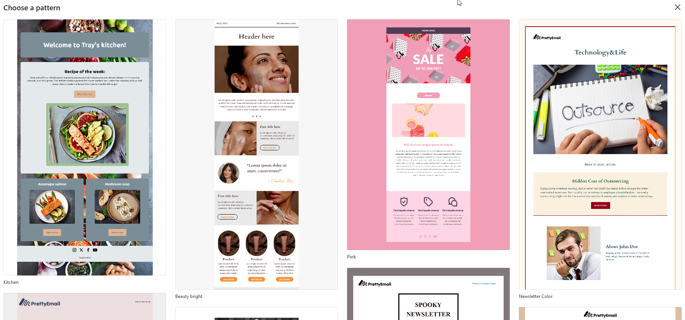
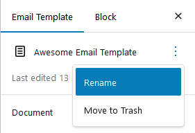
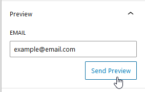

# Booking Calendar

**Booking Calendar integration with Pretty Email** combines powerful appointment scheduling with professional email template design. Booking Calendar manages your reservations, availability, and bookings, while Pretty Email ensures every confirmation, reminder, and notification reflects your brand and engages your clients.

:::tip Perfect Pairing
Configure both plugins in approximately **10 minutes** to transform appointment emails from basic text notifications into branded, professional communications.
:::

## How They Work Together

**Booking Calendar** and **Pretty Email** create a complete appointment management experience:

- **Booking Calendar**: Handles reservation scheduling, calendar availability, time slots, and booking management
- **Pretty Email**: Controls notification appearance and template presentation for consistent branding

Consider this analogy: Booking Calendar is your scheduling assistant, organizing appointments and managing reservations. Pretty Email is your brand designer, ensuring every client touchpoint looks polished and professional.

:::info Integration Benefits
Combining both plugins provides:
- **Professional appearance** - Branded templates build trust and reinforce your business identity with every notification
- **Consistent messaging** - Unified design across all appointment communications strengthens brand recognition
- **Enhanced credibility** - Well-designed emails establish professionalism and increase client confidence
- **Better engagement** - Visually appealing notifications improve client response rates and reduce no-shows
- **Flexible customization** - Match email designs perfectly to your website and business branding
:::

## Prerequisites

Before setting up this powerful combination, ensure you have:

- **Booking Calendar plugin** installed and configured for your business ([Free](https://wordpress.org/plugins/booking/) or Premium version)
- **Pretty Email plugin** installed and activated ([Setup Instructions](../installation-and-license.md))
- WordPress 5.0+ with PHP 7.4 or newer
- Active booking forms configured in Booking Calendar
- Understanding of your Booking Calendar notification settings

:::info Getting Started
[Download Pretty Email](https://bracketspace.com/downloads/pretty-email/) to elevate your appointment notifications, and combine it with [Booking Calendar](https://wpbookingcalendar.com/) for comprehensive reservation management.
:::

## Step-by-Step Integration Guide

### 1. Configure Booking Calendar First

Establish your booking system functionality before implementing email templates:

1. Navigate to **Booking** → **Settings** in WordPress admin

   

2. Configure your booking form fields and appointment options

   

3. Set up your **calendar availability** and time slots

   
   

4. Configure **email notifications** in Booking → Settings → Email section

   

   Be sure to select a `Plain text` email format.

   

5. Test your booking form to ensure reservations are captured correctly

:::warning Booking System First
Professional email templates enhance communication, but your booking system must function correctly first. Always verify Booking Calendar captures reservations properly before styling notifications.
:::

### 2. Enable Pretty Email for WordPress Emails

Activate Pretty Email to style notifications sent by Booking Calendar:

1. Go to **Appearance** → **Pretty Email**

   

2. Access the **Settings** tab

   

3. Enable **WordPress Emails** in the Integrations section

   

### 3. Design Your Email Template

Create or customize templates for your booking notifications:

1. In Pretty Email, select **Add New Template**

   

2. Choose from pre-designed patterns or start with a blank canvas

   

3. Build your template with essential components:
   - Start with a **Section** block for structure
   - Add an **Email Body** block to display booking details
   - Include branding elements (logo, business name, contact info)
   - Customize colors, fonts, and spacing to match your brand
   - Consider adding contact information or cancellation policies

4. Name your template descriptively in the Settings panel

   

5. Preview your template with test content

   

:::note Email Body Block Required
Your template **must include an Email Body block** to display booking confirmation details, appointment times, and customer information. Without this block, only your template wrapper will appear.
:::

:::tip Template Design Resources
Review [Creating New Templates](../composing-templates/creating-new-template.md) and [Block Composition Guide](../composing-templates/composing-templates-with-blocks.md) for detailed template building instructions.
:::

### 4. Set Your Default Template

Assign the template that Booking Calendar will use for notifications:

1. Stay in Pretty Email **Settings** tab
2. Find the **Default Template** dropdown
3. Choose your appointment notification template

   

4. Click **Save Changes**

### 5. Test Complete Integration

Verify both plugins work seamlessly together:

1. Submit a test booking through your booking form
2. Check the admin notification email for:
   - **Successful delivery** (confirms email sending works)
   - **Professional styling** (confirms Pretty Email template applies)
   - **Complete booking details** (confirms Email Body block displays data)
3. Check customer confirmation email as well
4. Verify all booking information displays correctly in the template

:::tip Testing Best Practices
Test with real email addresses across different providers (Gmail, Outlook, Yahoo) to ensure templates render beautifully while Booking Calendar data displays accurately.
:::

## Understanding the Integration

### What Pretty Email Handles

Pretty Email manages visual presentation:

- Email template design and layout structure
- Branding elements (logos, colors, typography)
- Consistent styling across all booking notifications
- Template reusability for different notification types

### What Booking Calendar Handles

Booking Calendar manages appointment operations:

- Reservation and appointment scheduling
- Calendar availability management
- Time slot configuration
- Booking form data collection
- Email notification triggers

### How They Complement Each Other

1. **Customer submits** booking through your calendar form
2. **Booking Calendar processes** the reservation and stores booking data
3. **Pretty Email wraps** the notification in your branded template
4. **Email is sent** to customer and admin with professional styling
5. **Booking Calendar manages** the appointment in your admin panel

## Customization Options

### Template Design

Customize your booking notification appearance through Pretty Email:

- **Business Branding**: Add your logo, business colors, and professional fonts
- **Layout Variations**: Choose from multiple template structures for different booking types
- **Design Patterns**: Select from professional, modern, or custom appointment designs
- **Dynamic Content Slots**: Insert booking details dynamically with Email Body blocks
- **Block-Based Design**: Drag-and-drop Gutenberg blocks for easy template creation

### Booking Configuration

Optimize your reservation system through Booking Calendar:

- **Notification Types**: Configure emails for new bookings, confirmations, approvals, and cancellations
- **Email Recipients**: Set who receives notifications (admin, customer, or both)
- **Booking Forms**: Customize fields to collect necessary customer information
- **Calendar Display**: Configure how availability appears to potential clients
- **Time Slots**: Define specific appointment times or allow full-day bookings

## Troubleshooting Common Issues

### Booking Emails Not Received

**Problem**: Customers or admins aren't receiving booking notifications.

**Solution**:
1. **Check Booking Calendar first**: Test email sending from Booking → Settings → Email
2. Verify recipient email addresses are correct in Booking Calendar settings
3. Check spam/junk folders for missing notifications
4. Confirm WordPress can send emails (test with password reset)
5. Consider using an SMTP plugin for improved email delivery
6. Review Booking Calendar email notification settings are enabled

### Booking Emails Not Styled

**Problem**: Notifications arrive without Pretty Email template styling.

**Solution**:
1. Confirm WordPress Emails integration is enabled in Pretty Email
2. Verify a default template is selected in Pretty Email settings
3. Ensure your template includes an Email Body block
4. Check that Booking Calendar sends plain-text emails (Pretty Email styles plain-text only)
5. Clear any caching plugins that might affect email generation
6. Test with a fresh booking submission

### Booking Details Missing from Emails

**Problem**: Template appears but booking information doesn't display.

**Solution**:
1. Verify the Email Body block exists in your Pretty Email template
2. Check Booking Calendar email template settings haven't removed merge tags
3. Ensure Booking Calendar notification templates contain booking details
4. Test booking form submissions to confirm data is captured
5. Review Booking Calendar email template configuration

### Template Design Breaks in Email Clients

**Problem**: Booking notifications appear misaligned or broken in some email applications.

**Solution**:
1. Test across multiple email clients (Gmail, Outlook, Apple Mail, Yahoo)
2. Simplify complex layouts for better email client compatibility
3. Use web-safe fonts for universal rendering
4. Ensure images are properly hosted and accessible
5. Keep table-based layouts simple for reliable display

### Different Notifications Use Same Template

**Problem**: All booking notification types (confirmation, approval, cancellation) use identical styling.

**Solution**:
Currently, the WordPress integration applies one default template to all emails. Here are your options:

1. **Design a versatile template** - Create a universal template design that works effectively for all booking notification types (confirmations, approvals, reminders, cancellations). Focus on clean layout and clear Email Body placement.

2. **Customize content in Booking Calendar** - Use Booking Calendar's email template settings to differentiate notification types through subject lines, message content, and merge tags. The content varies while maintaining consistent styling.

3. **Use the Notification plugin** - For advanced per-notification template selection, implement our [Notification plugin integration](notification.md) which offers trigger-based template customization and complete control over which template applies to each notification type.

4. **Apply custom WordPress filters** - If you have development resources, use WordPress email hooks like `wp_mail` to programmatically assign different templates based on email subject, recipient, or content patterns.

### Booking Calendar Emails Changed Format

**Problem**: After activating Pretty Email, booking notifications look different than expected.

**Solution**:
1. Review your template design in Pretty Email editor
2. Ensure Email Body block placement displays booking details prominently
3. Adjust template styling to highlight important booking information
4. Use Pretty Email's preview feature to test appearance before sending
5. Remember that Pretty Email transforms plain-text content into styled HTML

## Frequently Asked Questions

**Q: Do I need both plugins, or can I use just one?**

A: Each plugin serves distinct purposes. Booking Calendar provides appointment scheduling and reservation management, while Pretty Email handles notification design and branding. You can use Booking Calendar alone for functional booking emails, but Pretty Email adds professional polish that enhances client experience and reinforces your brand.

**Q: Will Pretty Email affect booking notification delivery speed?**

A: No. Pretty Email applies templates during email generation, adding negligible processing time. Email delivery speed depends on your hosting environment and SMTP configuration. For optimal delivery, consider pairing with a dedicated SMTP service.

**Q: Can I use different templates for different booking types?**

A: With the basic WordPress integration, one default template applies to all emails. For advanced per-notification template selection, explore our [Notification plugin integration](notification.md) which offers trigger-based template customization.

**Q: Does this work with Booking Calendar Premium versions?**

A: Yes! Pretty Email works seamlessly with both free and premium versions of Booking Calendar. All notification emails sent by Booking Calendar can be styled with Pretty Email templates, regardless of your Booking Calendar version.

**Q: Can I preview booking emails before customers receive them?**

A: Use Pretty Email's template preview feature to see your design. For complete testing with actual booking data, submit test reservations through your booking form and send to your own email address.

**Q: What happens if Pretty Email is deactivated?**

A: Booking Calendar will revert to sending standard plain-text notification emails. All booking functionality remains intact; only the visual styling disappears. Bookings continue being captured and processed normally.

**Q: Can I add business policies or terms to booking notification templates?**

A: Absolutely! Pretty Email templates support custom blocks where you can insert cancellation policies, contact information, directions, terms and conditions, or any other content relevant to your appointments.

**Q: Will this integration work with third-party calendar sync?**

A: Pretty Email only affects email notification appearance, not booking data or calendar synchronization. If you use Booking Calendar's sync features with Google Calendar or other services, those integrations continue functioning normally.

## Related Resources

### Other Integration Guides
- [WordPress Default Emails](wordpress.md) - Basic WordPress email styling
- [WooCommerce Email Templates](woocommerce.md) - E-commerce notification design
- [Contact Form 7 Templates](contact-form-7.md) - Contact form email styling
- [Gravity Forms Integration](gravity-forms.md) - Advanced form notification templates

### Template Design Resources
- [Creating New Templates](../composing-templates/creating-new-template.md) - Build custom email designs
- [Template Blocks](../composing-templates/composing-templates-with-blocks.md) - Understanding email components
- [Global Settings](../composing-templates/global-template-settings/index.md) - Brand consistency configuration

### Need Help?
Experiencing difficulties integrating Pretty Email with Booking Calendar? [Contact our support team](mailto:support@bracketspace.com) for personalized assistance with your appointment notification setup.

:::tip Professional Recommendation
For service-based businesses, appointment booking is a critical client touchpoint. Combining Booking Calendar's robust scheduling with Pretty Email's professional templates creates a seamless, branded experience from initial booking through appointment confirmation. This integration demonstrates professionalism and attention to detail that clients notice and appreciate.
:::
