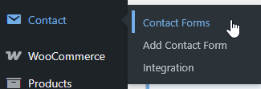
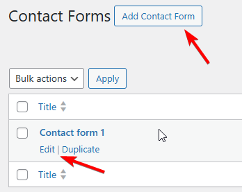

# Design Beautiful Contact Form 7 Emails

**Contact Form 7 email template integration** transforms your plain text form notifications into professional, branded communications that build trust and improve user experience. By default, Contact Form 7 sends basic plain text emails, but with Pretty Email, you can create stunning email templates that match your brand and convert better.

:::tip Quick Setup
Transform your CF7 emails in just **5 minutes** with our step-by-step guide below. No coding required!
:::

## Prerequisites

Before integrating Pretty Email with Contact Form 7, ensure you have:

- **Contact Form 7** plugin installed and active
- **Pretty Email** plugin installed and active ([Installation Guide](../installation-and-license.md))
- WordPress 5.0+ and PHP 7.4+
- At least one contact form created in CF7

:::info Don't have Pretty Email yet?
[Download Pretty Email](https://bracketspace.com/downloads/pretty-email/) and start designing beautiful email templates today.
:::

## Step-by-Step Integration Guide

### 1. Enable Pretty Email for WordPress Emails

First, enable Pretty Email to handle WordPress default emails (which includes Contact Form 7):

1. Navigate to **Appearance** → **Pretty Email**

    

2. Go to the **Settings** tab

    

3. Turn on **WordPress Emails** in the Integrations section

    

### 2. Select Your Default Email Template

Choose the template that will be applied to your Contact Form 7 emails:

1. In the **Settings** tab, find the **Default Template** dropdown
2. Select your preferred email template from the list

    

:::note Email Body Block Required
Make sure your chosen template includes an **Email Body block** to display the form submission content.
:::

### 3. Configure Your Contact Form

Set up your Contact Form 7 to work optimally with Pretty Email templates:

1. Go to **Contact** → **Contact Forms**

    

2. Edit your existing form or create a new one

    

3. Ensure your form includes proper field labels for better email formatting

### 4. Test Your Email Integration

Always test your integration before going live:

1. Submit a test form from your website
2. Check your inbox for the formatted email
3. Verify all dynamic fields are displaying correctly
4. Test on both desktop and mobile email clients

## Customization Options

### Brand Styling

Make your emails match your brand identity:

- **Logo Integration**: Add your company logo to email headers
- **Color Scheme**: Match your website's color palette
- **Typography**: Use consistent fonts across all communications
- **Layout**: Choose from various template layouts

### Template Gallery

Browse our [template library](../composing-templates/creating-new-template.md) for inspiration and ready-to-use designs:

- Professional business templates
- Creative agency layouts  
- E-commerce focused designs
- Minimalist modern styles

## Troubleshooting Common Issues

### Email Not Received

**Problem**: Contact form submissions aren't generating emails.

**Solution**:
1. Verify your Contact Form 7 mail template settings
2. Check that your hosting provider allows email sending
3. Install an SMTP plugin like WP Mail SMTP for better delivery
4. Test with a different email address

### Plain Text Instead of Template

**Problem**: Emails are still appearing as plain text.

**Solution**:
1. Ensure WordPress Emails integration is active
2. Confirm the default template is properly selected
3. Verify your template includes an Email Body block
4. Check that CF7 is sending plain text emails
5. Clear any caching plugins

### Missing Form Data

**Problem**: Form submission details aren't appearing in emails.

**Solution**:
1. Ensure the Email Body block is placed in your template
2. Check Contact Form 7 mail template settings
3. Verify form field names match expected format
4. Test with a simple form first

### Styling Issues

**Problem**: Email template doesn't match expected design.

**Solution**:
1. Check email client compatibility (some clients strip CSS)
2. Use web-safe fonts and colors
3. Test in multiple email clients (Gmail, Outlook, Apple Mail)
4. Simplify complex layouts for better compatibility

### Template Not Applied

**Problem**: Specific forms aren't using Pretty Email templates.

**Solution**:
1. Confirm WordPress Emails integration is active
2. Ensure the default template is properly selected
2. Check that CF7 is sending plain text emails (HTML emails aren't wrapped)
3. Verify no conflicting email plugins are installed
4. Review CF7 mail settings for custom configurations

## Frequently Asked Questions

**Q: Can I use different templates for different contact forms?**

A: Currently, the WordPress integration applies one default template to all Contact Form 7 emails. For form-specific templates, consider using our [Gravity Forms integration](gravity-forms.md) which offers more granular control.

**Q: Will this work with Contact Form 7 add-ons?**

A: Yes, Pretty Email works with most CF7 add-ons since it processes the final email output. However, complex add-ons that modify email structure may require testing.

**Q: Does this affect email delivery rates?**

A: Pretty Email can improve engagement but doesn't directly affect deliverability. For better delivery rates, use an SMTP service like SendGrid or Mailgun.

**Q: Can I include images in my Contact Form 7 emails?**

A: Yes, you can add images to your Pretty Email templates. User-uploaded images from file upload fields will be handled according to your CF7 configuration.

**Q: Is there a way to preview emails before sending?**

A: You can preview your templates in the Pretty Email editor, but for full Contact Form 7 integration testing, submit actual test forms to see the complete email output.

## Related Resources

### Other Form Integrations
- [Gravity Forms Email Templates](gravity-forms.md) - More advanced form integration options
- [WooCommerce Emails](woocommerce.md) - E-commerce email templates
- [WordPress Default Emails](wordpress.md) - System email customization

### Template Design
- [Creating New Templates](../composing-templates/creating-new-template.md) - Build custom email designs
- [Template Blocks](../composing-templates/composing-templates-with-blocks.md) - Understanding email blocks
- [Global Settings](../composing-templates/global-template-settings/index.md) - Brand consistency across templates

### Getting Help
Need assistance with your Contact Form 7 integration? [Contact our support team](mailto:support@bracketspace.com) for personalized help with your email template setup.

:::tip Pro Tip
For the best results, keep your Contact Form 7 forms simple and focused. Complex forms with many fields can create cluttered emails, even with beautiful templates.
:::