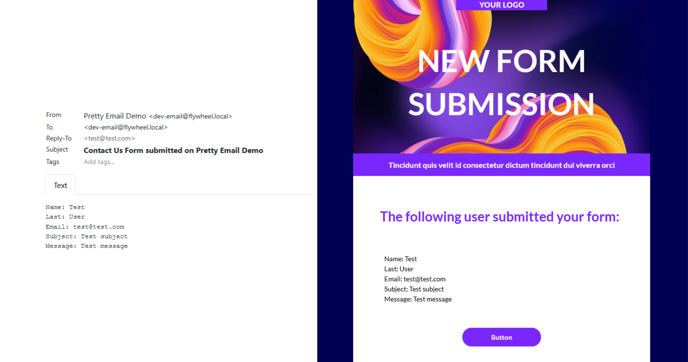
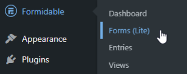
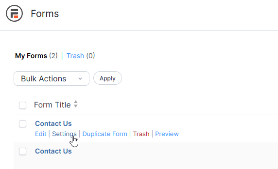
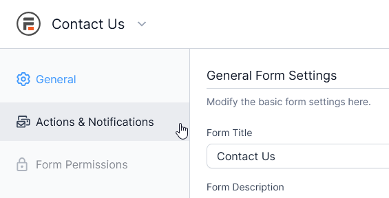
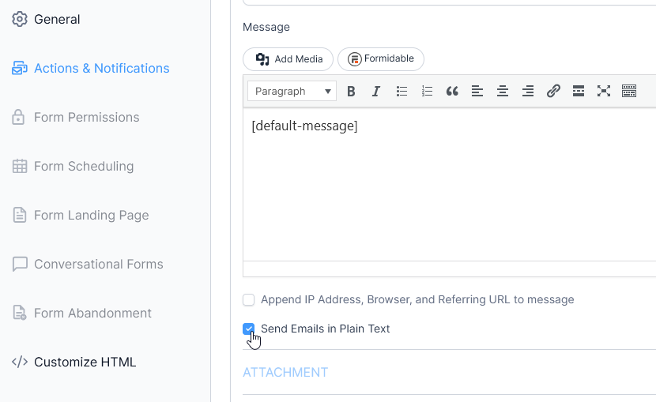

# Formidable Forms

**Formidable Forms email template integration** transforms standard form submission alerts into visually compelling, branded communications. While Formidable Forms provides powerful form-building capabilities, Pretty Email adds the visual polish your email notifications need to make a lasting impression and reinforce your brand identity with every form submission.

:::tip Quick Setup
Style your Formidable Forms emails in approximately **6 minutes** with our straightforward integration guide. Technical expertise not required!
:::

## Prerequisites

Before integrating Pretty Email with Formidable Forms, ensure you have:

- **Formidable Forms** plugin installed and activated
- **Pretty Email** plugin installed and activated ([Installation Guide](../installation-and-license.md))
- WordPress 5.0+ with PHP 7.4 or newer
- At least one form created in Formidable Forms
- Basic familiarity with Formidable Forms settings

:::info New to Pretty Email?
[Download Pretty Email](https://bracketspace.com/downloads/pretty-email/) to start designing professional email templates for your WordPress forms.
:::

## Step-by-Step Integration Guide

### 1. Enable Pretty Email for WordPress Emails

Activate Pretty Email to handle WordPress default emails (which includes Formidable Forms):

1. Navigate to **Appearance** → **Pretty Email**

   

2. Access the **Settings** tab

   

3. Enable **WordPress Emails** in the Integrations section

   

### 2. Choose Your Email Template

Select the template design for your Formidable Forms notifications:

1. Within the **Settings** tab, locate the **Default Template** dropdown menu
2. Choose your preferred email template design

   

:::note Email Body Block Required
Your selected template must include an **Email Body block** to properly display form submission data and messages.
:::

### 3. Configure Formidable Forms Email Actions

Configure each form's email actions to send as plain text:

1. Go to **Formidable** → **Forms**

   

2. Click **Settings** for the form you want to configure

   

3. Navigate to the **Actions & Notifications** tab

   

4. Click on your email action to edit it (or create a new Email action if none exists)

   

5. Scroll down and check the **"Send Emails in Plain Text"** checkbox

   

6. Save your form action settings

:::warning Important
Formidable Forms sends HTML emails by default. You **must** enable the "Send Emails in Plain Text" option for each email action you want to style with Pretty Email. HTML emails will not be wrapped in Pretty Email templates.
:::

:::info Multiple Email Actions
If your form has multiple email actions (e.g., admin notification, user confirmation), you'll need to enable "Send Emails in Plain Text" for each action you want to apply Pretty Email templates to.
:::

### 4. Test Your Integration

Always verify your setup works correctly:

1. Submit a test form entry
2. Check the recipient email inbox for the styled notification
3. Verify all form field data displays accurately within the template
4. Test across different email clients (Gmail, Outlook, Apple Mail)

## Customization Options

### Brand Styling

Align your form notification emails with your brand:

- **Logo**: Add your company or organization logo to email headers
- **Color Scheme**: Match your website's color palette
- **Typography**: Use consistent fonts across your communications
- **Layout**: Select from various professional template layouts
- **Footer**: Include social media links and contact information

### Template Design Library

Explore our [template collection](../composing-templates/creating-new-template.md) for design inspiration:

- Professional business layouts
- Modern minimalist styles
- Clean transactional templates
- Customizable design patterns

## Troubleshooting Common Issues

### Emails Not Being Templated

**Problem**: Formidable Forms notifications still appear in default HTML format without Pretty Email styling.

**Solution**:
1. **Most Common Fix**: Verify you've enabled "Send Emails in Plain Text" for each email action in your form settings
2. Confirm WordPress Emails integration is enabled in Pretty Email settings
3. Check that a default template is selected in Pretty Email settings
4. Ensure your template includes an Email Body block
5. Clear any caching plugins
6. Test with a fresh form submission

### Form Data Not Displaying

**Problem**: Form submission details aren't appearing in emails.

**Solution**:
1. Verify the Email Body block exists in your Pretty Email template
2. Check Formidable Forms email action message field contains proper shortcodes
3. Confirm form fields are properly configured
4. Test with a complete form submission including all fields

### Emails Not Sending

**Problem**: No emails arriving after form submissions.

**Solution**:
1. Verify Formidable Forms email actions are enabled
2. Check your WordPress site can send emails (test with password reset)
3. Install an SMTP plugin like WP Mail SMTP for reliable delivery
4. Verify email addresses are correctly configured in form action settings
5. Check spam/junk folders

### Template Layout Issues

**Problem**: Emails display incorrectly in certain email clients.

**Solution**:
1. Test in multiple email applications (Gmail, Outlook, Apple Mail, Yahoo)
2. Use standard web-safe fonts for better compatibility
3. Simplify complex layouts for universal rendering
4. Ensure images are properly hosted and accessible
5. Avoid advanced CSS features that email clients may strip

## Frequently Asked Questions

**Q: Why aren't my Formidable Forms emails using Pretty Email templates?**

A: The most common reason is that the email action isn't set to send plain text. Formidable Forms sends HTML emails by default. Go to your form settings → Actions & Notifications, edit each email action, and check the "Send Emails in Plain Text" option.

**Q: Can I use different templates for different forms?**

A: Currently, the WordPress integration applies one default template to all Formidable Forms plain text emails. For more granular control over different form types, consider using our [Notification plugin integration](notification.md) which offers advanced trigger-based template selection per form, or switch to [Gravity Forms](gravity-forms.md) which has built-in per-notification template selection.

**Q: Does this work with Formidable Forms premium add-ons?**

A: Yes, Pretty Email works with Formidable Forms add-ons since it processes the final email output. However, each email action in any add-on must be configured to send as plain text for Pretty Email styling to apply.

**Q: Can I still use Formidable's email formatting options?**

A: When you enable "Send Emails in Plain Text," Formidable will use a simple text editor instead of the rich text editor. You'll work with shortcodes and plain text, which Pretty Email will then wrap in your branded template. The template handles the visual formatting.

**Q: Does this work with form autoresponders?**

A: Yes, autoresponder email actions work the same way. Simply enable "Send Emails in Plain Text" for each autoresponder action you want to style with Pretty Email.

**Q: What happens to HTML-formatted Formidable Forms emails?**

A: Pretty Email specifically wraps plain text emails. If you leave Formidable's email actions set to HTML (default), they will not be wrapped in Pretty Email templates and will use their original formatting.

**Q: Can I include images in my form notification emails?**

A: Yes, you can add images to your Pretty Email templates. File attachments from Formidable file upload fields will be handled according to your form's attachment settings.

## Related Resources

### Other Form Integrations
- [Gravity Forms Email Templates](gravity-forms.md) - Advanced form integration with per-notification control
- [Contact Form 7 Templates](contact-form-7.md) - Simple contact form email styling
- [WordPress Default Emails](wordpress.md) - System email customization

### Template Design Resources
- [Creating New Templates](../composing-templates/creating-new-template.md) - Build custom email designs
- [Template Blocks](../composing-templates/composing-templates-with-blocks.md) - Understanding email components
- [Global Settings](../composing-templates/global-template-settings/index.md) - Brand consistency configuration

### Need Assistance?
Having trouble integrating Pretty Email with Formidable Forms? [Contact our support team](mailto:support@bracketspace.com) for personalized help with your form email template setup.

:::tip Best Practice
Keep your Formidable Forms email messages concise when using plain text format. The Pretty Email template will handle the visual presentation, so focus your email action message on the essential form data and information. Use Formidable's shortcodes to insert dynamic form field values.
:::
