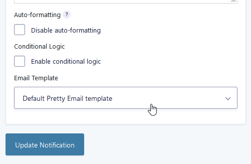

# Gravity Forms

**Gravity Forms email template integration** with Pretty Email allows you to create beautiful, professional notifications for form submissions. Design custom email templates that match your brand for contact forms, registration forms, and more.

If you use Notifications in the Gravity Form plugin, you can wrap them up in the Pretty Email template.

1.  Go to the `Notifications` tab in your GF form settings

    

2. Select the notification you want to edit
3.  At the bottom of the notification edit screen, you can choose the template that you want to use

    

You can choose one of 3 options:

1. No email template - if you don't want to use any Pretty Email template on this notification
2. Default Pretty Email template - if you want to use whichever template is set up as default in the PE settings (see [WordPress](wordpress.md) integration)
3. Specifically, choose one of your saved templates

:::note
Remember to put an Email Body block in the chosen template for the email to contain the message set in the notification.
:::