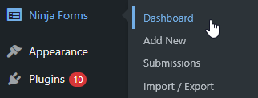
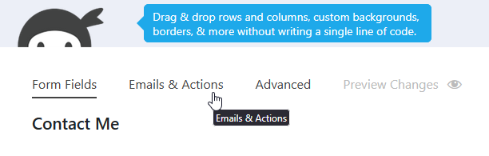

# Ninja Forms

**Ninja Forms email transformation with Pretty Email** upgrades your standard form notifications into eye-catching, professionally designed messages that capture attention and reinforce your brand. Transform basic text-only form notifications into visually compelling emails that recipients actually want to read and respond to.

:::tip Swift Integration
Transform your Ninja Forms notifications in approximately **6 minutes** with our streamlined setup process below. Zero coding knowledge required!
:::

## Prerequisites

Before connecting Pretty Email with Ninja Forms, verify you have:

- **Ninja Forms plugin** installed and functioning on your WordPress site
- **Pretty Email plugin** installed and activated ([Setup Guide](../installation-and-license.md))
- WordPress 5.0 or higher with PHP 7.4+ recommended
- At least one published form created in Ninja Forms
- Basic familiarity with WordPress email functionality

:::info Don't Have Pretty Email Yet?
[Get Pretty Email now](https://bracketspace.com/downloads/pretty-email/) and begin creating stunning form notification designs immediately.
:::

## Step-by-Step Integration Guide

### 1. Activate Pretty Email for WordPress Core Emails

Begin by enabling Pretty Email to handle WordPress default emails (which includes Ninja Forms notifications):

1. Access **Appearance** → **Pretty Email**

    

2. Navigate to the **Settings** tab

    

3. Turn on **WordPress Emails** in the Integrations section

    

### 2. Create Your Custom Email Template

Build a distinctive email template for your Ninja Forms notifications:

1. In Pretty Email, select **Add New Template**

    

2. Select from professional preset templates or create from a blank slate

    

3. Construct your template with essential elements:
   - Add a **Section** block to create your layout foundation
   - Insert an **Email Body** block where form submission data will appear
   - Include branding components such as logos, headers, and footers
   - Modify colors, typography, and spacing to align with your brand
   - Add call-to-action buttons or social links as needed

4. Assign a descriptive name to your template in the Settings panel

    

5. Send a test message to preview the design in your email client

    

:::note Email Body Block Essential
Your template **must include an Email Body block** to display the Ninja Forms submission data. Without this block, form responses won't appear in notification emails.
:::

:::tip Template Building Resources
Explore [Creating New Templates](../composing-templates/creating-new-template.md) and [Composing Templates with Blocks](../composing-templates/composing-templates-with-blocks.md) for comprehensive template design guidance.
:::

### 3. Choose Your Default Email Template

Specify which template will style your Ninja Forms notifications:

1. Within the **Settings** tab, find the **Default Template** dropdown
2. Pick your desired email template from the available list

    

:::note Template Requirements
Ensure your selected template includes an **Email Body block** to display the form submission content properly.
:::

### 4. Configure Your Ninja Forms Settings

Optimize your Ninja Forms configuration for Pretty Email integration:

1. Navigate to **Ninja Forms** → **Dashboard** from your WordPress admin

    

2. Select the form you want to configure or create a new one
3. Open the form builder and click on **Emails & Actions**

    

4. Review your email notification settings
5. Verify recipient email addresses are correct

    <!-- TODO: Edit this step -->

6. Ensure **Email Type** is set to **Plain Text** format ???HOW???

    <!-- TODO: Add screenshot - ninja-forms-plain-text-format.png -->
    <!--  -->

7. Use clear, descriptive field labels for better email readability

:::tip Field Label Optimization
Apply meaningful labels to your form fields to create clean, professional notification emails. Well-structured field labels make submission data easy to scan and understand.
:::

### 5. Verify Your Integration

Always perform comprehensive testing before deploying:

1. Submit a test form through your live website
2. Check your email inbox for the styled notification
3. Verify all form submission data displays accurately
4. Test email appearance on both mobile devices and desktop email clients
5. Confirm all links and buttons function correctly

## Customization Options

### Brand Consistency

Align your email design with your brand standards:

- **Logo Display**: Position your brand logo prominently in the email header
- **Color Palette**: Apply your brand's color scheme throughout the template
- **Font Selection**: Use typography that matches your website and brand guidelines
- **Layout Design**: Choose from various template structures that suit your style
- **Footer Elements**: Add social media icons, contact information, and legal notices

### Template Gallery

Visit our [template library](../composing-templates/creating-new-template.md) for ready-made designs and creative ideas:

- Professional corporate templates
- Modern minimalist layouts
- Creative boutique styles
- Clean service-oriented designs

## Troubleshooting Common Issues

### Notifications Not Arriving

**Problem**: Form submissions complete successfully but notification emails don't arrive.

**Solution**:
1. Check Ninja Forms email notification settings for correct configuration
2. Verify your hosting provider allows outbound email delivery
3. Install an SMTP plugin like WP Mail SMTP to enhance delivery reliability
4. Test with an alternative email address to rule out spam filtering
5. Review server email logs for delivery errors

### Templates Not Rendering

**Problem**: Notification emails still appear as plain text without styling.

**Solution**:
1. Confirm WordPress Emails integration is active in Pretty Email settings
2. Verify your default template selection is saved properly
3. Ensure your chosen template contains the Email Body block

    <!-- TODO: Edit this step -->

4. Check that Ninja Forms sends plain text format (HTML emails won't be wrapped)
5. Clear all caching plugins and WordPress object cache

### Form Data Not Displaying

**Problem**: Notification emails arrive empty or without submission details.

**Solution**:
1. Verify the Email Body block exists in your Pretty Email template
2. Check Ninja Forms notification settings for proper field mapping
3. Confirm form field names use standard conventions
4. Test with a simplified form structure first to isolate issues

### Design Display Issues

**Problem**: Email template appears broken or incorrectly formatted.

**Solution**:
1. Test across multiple email clients (Gmail, Outlook, Apple Mail, Yahoo) as some strip CSS
2. Use web-safe fonts and standard color values
3. Simplify complex design elements for better compatibility
4. Preview templates in Pretty Email editor before sending live

### Inconsistent Template Application

**Problem**: Some forms use styling while others send plain text notifications.

**Solution**:
1. Confirm WordPress Emails integration is enabled in Pretty Email
2. Verify default template is properly assigned
3. Check that all Ninja Forms are configured to send plain text emails
4. Identify potential conflicts with other email-handling plugins
5. Review individual form email settings for custom overrides

## Frequently Asked Questions

**Q: Can I assign different templates to individual Ninja Forms?**

A: The WordPress Emails integration currently applies one universal template to all Ninja Forms notifications. For form-specific template control, explore our [Gravity Forms integration](gravity-forms.md) which offers per-form customization capabilities.

**Q: Does Pretty Email work with Ninja Forms add-ons?**

A: Yes! Pretty Email integrates seamlessly with Ninja Forms core functionality and maintains compatibility with most add-ons, as it processes the final email output. Extensions that significantly modify email structure should be tested individually.

**Q: Will Pretty Email impact my form notification delivery rates?**

A: Pretty Email enhances visual presentation and professionalism but operates independently from email delivery infrastructure. For optimal delivery success, combine Pretty Email with dedicated SMTP services like SendGrid, Mailgun, or Amazon SES.

**Q: Can I include images in Ninja Forms notification emails?**

A: Absolutely! Your Pretty Email templates fully support image integration. User-uploaded files from form submissions (if using file upload fields) follow your existing Ninja Forms processing configuration.

**Q: How can I preview notifications before activating them on production forms?**

A: Template preview functionality is built into the Pretty Email editor. For complete end-to-end testing with actual form data, submit test entries through your website to evaluate full notification rendering.

**Q: Is Pretty Email compatible with both free and premium Ninja Forms versions?**

A: Yes! Pretty Email maintains full compatibility with Ninja Forms (free version) and Ninja Forms premium add-ons. Integration steps remain consistent across all versions.

## Related Resources

### Additional Form Integration Guides
- [Contact Form 7 Design Options](contact-form-7.md) - Simple contact form customization
- [Gravity Forms Templates](gravity-forms.md) - Advanced form builder integration
- [WordPress System Emails](wordpress.md) - Core WordPress notification styling

### Email Design Resources
- [Template Creation Guide](../composing-templates/creating-new-template.md) - Build personalized email designs
- [Block Component Reference](../composing-templates/composing-templates-with-blocks.md) - Master email building elements
- [Global Configuration Settings](../composing-templates/global-template-settings/index.md) - Maintain brand consistency site-wide

### Support Access
Need help with Ninja Forms integration? [Reach out to our support team](mailto:support@bracketspace.com) for expert assistance with email template configuration and customization.

:::tip Design Best Practice
Keep form structures focused and concise for optimal notification clarity. Overly complex forms with excessive fields create dense email content that can overwhelm recipients. Consider conditional logic and multi-page forms for improved user experience and cleaner notifications.
:::
