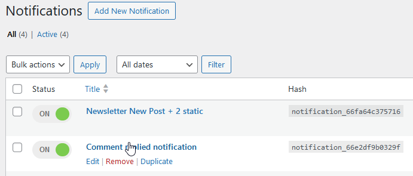
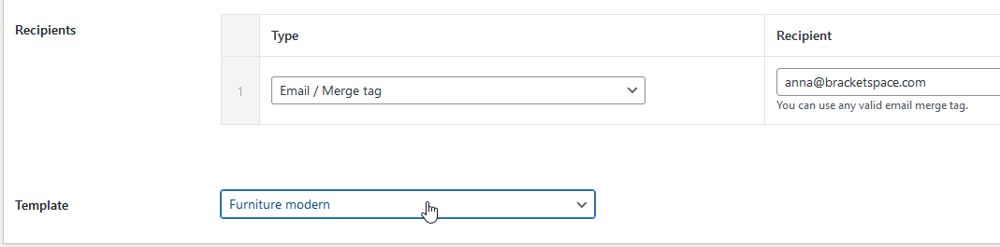

# Notification

To use Pretty Email templates in the [Notification](https://wordpress.org/plugins/notification/) plugin, go to your notifications list and enter a notification edit:

At the bottom of the Carrier box, you can choose the template that you want to use for the notification:

You can choose one of 3 options:

1. No email template - if you don't want to use any Pretty Email template on this notification
2. Default Pretty Email template - if you want to use whichever template is set up as default in the Pretty Email settings (see [WordPress](wordpress.md) integration)
3. Specifically, choose one of your saved templates

:::note
Remember to put an Email Body block in the chosen template for the email to contain the message set in the notification.
:::