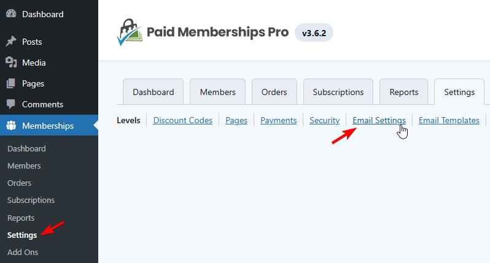
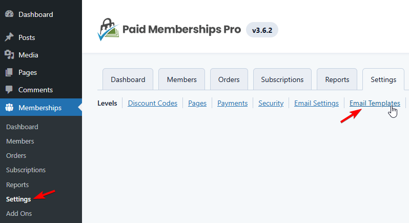

# Paid Memberships Pro

**Paid Memberships Pro email template integration** transforms standard subscription notifications into polished, professional communications that reflect your brand's quality. While Paid Memberships Pro excels at managing subscriptions and member access, Pretty Email ensures every confirmation, renewal reminder, and payment notification delivers a consistent, branded experience that reinforces member value and builds trust.

<!-- TODO: Add screenshot - paid-memberships-pro-before-after-comparison.jpg -->
<!--  -->

:::tip Quick Setup
Elevate your membership site emails in approximately **5 minutes** with this streamlined integration process. No technical skills required!
:::

## Prerequisites

Before integrating Pretty Email with Paid Memberships Pro, ensure you have:

- **Paid Memberships Pro** plugin installed and active
- **Pretty Email** plugin installed and active ([Installation Instructions](../installation-and-license.md))
- WordPress 5.0+ with PHP 7.4 or higher
- At least one membership level configured in PMPro
- Basic familiarity with Paid Memberships Pro settings

:::info New to Pretty Email?
[Get Pretty Email](https://bracketspace.com/downloads/pretty-email/) to start creating professional email templates for your WordPress membership site communications.
:::

## Understanding Paid Memberships Pro Email Handling

Paid Memberships Pro sends HTML-formatted emails by default and automatically generates plain text versions. The plugin uses WordPress's native `wp_mail()` function, which means Pretty Email can integrate seamlessly to wrap these notifications in your custom templates.

:::note Email Format
PMPro sends emails through WordPress's standard email system. Pretty Email intercepts these emails at the WordPress level and wraps them in your chosen template design while preserving all membership data and functionality.
:::

## Step-by-Step Integration Guide

### 1. Enable Pretty Email for WordPress Emails

Activate Pretty Email to handle WordPress emails (which includes Paid Memberships Pro):

1. Navigate to **Appearance** → **Pretty Email**

   

2. Click the **Settings** tab

   

3. Enable **WordPress Emails** in the Integrations section

   

### 2. Select Your Default Email Template

Choose the template design for your membership notifications:

1. In the **Settings** tab, locate the **Default Template** dropdown
2. Select your preferred email template from the available options

   

:::note Email Body Block Required
Your selected template must include an **Email Body block** to properly display subscription details, member information, and payment notifications from Paid Memberships Pro.
:::

### 3. Configure Paid Memberships Pro Email Settings (Optional)

Customize your email sender information:

1. Navigate to **Memberships** → **Settings** → **Email Settings** tab

   

2. Configure your **From Name** and **From Email** address
3. Click **Save Settings**

### 4. Customize Email Content (Optional)

While Pretty Email handles visual styling, you can customize message content in PMPro:

1. Navigate to **Memberships** → **Settings** → **Email Templates** tab

   

2. Click **Edit** on the notification type you want to customize (e.g., "Checkout - Free", "Billing - Failure", "Membership - Expiration")
3. Modify the subject line and body content
4. Use PMPro's template variables (e.g., `!!name!!`, `!!membership_level_name!!`, `!!billing_amount!!`)
5. Click **Save Email** to save your changes

:::info Template Variables
Paid Memberships Pro uses double exclamation marks for template variables like `!!sitename!!` and `!!membership_id!!`. These work perfectly with Pretty Email and will be replaced with actual member data.
:::

### 5. Test Your Email Integration

Always verify your integration works correctly:

1. Create a test membership level if needed
2. Complete a test registration or purchase
3. Check the recipient inbox for the styled notification
4. Verify all member details and subscription information display accurately
5. Test membership emails across different email clients (Gmail, Outlook, Apple Mail)
6. Review on both desktop and mobile devices

## Customization Options

### Brand Consistency

Align your membership emails with your brand identity:

- **Logo Integration**: Display your brand logo prominently in email headers
- **Color Palette**: Match your website's color scheme throughout emails
- **Typography**: Use consistent fonts across all member communications
- **Layout Options**: Choose from various professional template structures
- **Footer Content**: Add social links, contact information, or member support details

### Template Design Gallery

Explore our [template collection](../composing-templates/creating-new-template.md) for membership-optimized designs:

- Professional subscription layouts
- Modern transactional templates
- Clean notification designs
- Customizable membership frameworks

## Troubleshooting Common Issues

### Emails Not Using Pretty Email Templates

**Problem**: Paid Memberships Pro notifications appear without Pretty Email styling.

**Solution**:
1. Confirm WordPress Emails integration is enabled in Pretty Email → Settings
2. Verify a default template is selected in Pretty Email settings
3. Check that your template includes an Email Body block
4. Clear WordPress and browser caching
5. Test with a fresh membership action (new signup, payment, etc.)
6. Ensure no other email plugins are conflicting

### Member Information Not Displaying

**Problem**: Subscription details or member data aren't appearing in emails.

**Solution**:
1. Verify the Email Body block exists in your Pretty Email template
2. Check that PMPro email templates use correct template variables (e.g., `!!name!!`, `!!membership_level_name!!`)
3. Ensure PMPro is configured correctly with active membership levels
4. Test with a complete membership transaction

### Emails Failing to Send

**Problem**: Members aren't receiving email notifications.

**Solution**:
1. Verify PMPro email settings have valid From Name and From Email configured
2. Test WordPress email functionality with password reset
3. Install SMTP plugin like WP Mail SMTP or Post SMTP for reliable delivery
4. Check spam/junk folders for test emails
5. Review server email logs for delivery errors
6. Ensure membership level has email notifications enabled

### Template Layout Issues

**Problem**: Emails render incorrectly in certain email applications.

**Solution**:
1. Test across multiple email clients (Gmail web, Outlook, Apple Mail, Yahoo)
2. Use standard web-safe fonts for universal compatibility
3. Simplify complex layouts for better email client rendering
4. Ensure images are properly hosted and publicly accessible
5. Avoid advanced CSS features that email clients strip

### Specific Email Types Not Templated

**Problem**: Only some PMPro notification types use Pretty Email templates.

**Solution**:
1. Verify WordPress Emails integration covers all PMPro emails
2. Check if custom email add-ons have separate settings
3. Review PMPro email template settings for each notification type
4. Clear any email caching in PMPro or other plugins

## Frequently Asked Questions

**Q: Why aren't my Paid Memberships Pro emails displaying with Pretty Email templates?**

A: Ensure the WordPress Emails integration is enabled in Pretty Email settings and a default template is selected. PMPro sends emails through WordPress's standard email system, so Pretty Email should intercept them automatically. If not working, check for conflicting email plugins or caching issues.

**Q: Can I use different templates for different PMPro email types?**

A: The WordPress integration applies one default template to all emails. For more granular control over different notification types, consider using our [Notification plugin integration](notification.md) which allows you to create triggers for specific PMPro email events and assign different templates to each.

**Q: Does this work with Paid Memberships Pro paid add-ons?**

A: Yes, Pretty Email processes all emails sent through WordPress's email system, including those from PMPro premium add-ons. As long as the add-on uses PMPro's email system or WordPress's `wp_mail()` function, Pretty Email will style the notifications.

**Q: Can I still use PMPro's template variables?**

A: Absolutely! PMPro's template variables like `!!name!!`, `!!sitename!!`, `!!membership_level_name!!`, and `!!billing_amount!!` work perfectly with Pretty Email. Pretty Email wraps your content while preserving all dynamic functionality and variable replacements.

**Q: Does this affect payment processing or membership functionality?**

A: No, Pretty Email only handles the visual presentation of emails. All Paid Memberships Pro functionality including payment processing, membership levels, content restriction, and subscription management remains completely unchanged.

**Q: What happens to PMPro's built-in email templates?**

A: PMPro's email content (subject lines, body text, template variables) is preserved and wrapped in your Pretty Email template design. The content you edit in PMPro → Settings → Email Templates will appear within the Email Body block of your Pretty Email template.

**Q: Can I add promotional content to membership emails?**

A: Yes! Pretty Email templates support custom blocks where you can add promotional banners, upgrade opportunities, member benefits, social media links, or community highlights alongside subscription notifications.

**Q: Will this work with recurring subscription emails?**

A: Yes, Pretty Email styles all PMPro emails including recurring billing notifications, expiration warnings, renewal confirmations, and payment failure alerts. All subscription-related communications will use your branded template.

## Related Resources

### Other Membership & Subscription Integrations
- [WooCommerce Email Templates](woocommerce.md) - E-commerce and subscription emails
- [WordPress Default Emails](wordpress.md) - Core WordPress email customization
- [bbPress Forum Templates](bbpress.md) - Community forum email customization

### Template Design Resources
- [Creating New Templates](../composing-templates/creating-new-template.md) - Build custom email designs
- [Template Blocks Guide](../composing-templates/composing-templates-with-blocks.md) - Understanding email components
- [Global Template Settings](../composing-templates/global-template-settings/index.md) - Brand consistency configuration

### Additional Support
Need help integrating Pretty Email with Paid Memberships Pro? [Contact our support team](mailto:support@bracketspace.com) for personalized assistance with your membership site email template setup.

:::tip Best Practice
When customizing PMPro email content, focus on clear messaging about membership benefits, subscription details, and next steps. The Pretty Email template automatically provides visual polish and branding, allowing you to keep email body content concise and action-focused. Use PMPro's template variables to personalize each communication with member-specific information.
:::

## Sources

- [Paid Memberships Pro Email Settings Documentation](https://www.paidmembershipspro.com/documentation/admin/email-settings/)
- [List of PMPro Email Templates](https://www.paidmembershipspro.com/documentation/member-communications/list-of-pmpro-email-templates/)
- [Customizing Email Templates with PMPro](https://www.paidmembershipspro.com/documentation/member-communications/customizing-email-templates/)
- [PMPro Member Communications Guide](https://www.paidmembershipspro.com/documentation/member-communications/)
