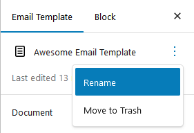

# Post SMTP

**Post SMTP integration with Pretty Email** unites powerful email delivery infrastructure with sophisticated template design. Post SMTP handles reliable email transmission through major SMTP providers, while Pretty Email ensures every message arrives with professional styling that reinforces your brand and engages recipients.

:::tip Powerful Combination
Set up both plugins in approximately **8 minutes** to achieve bulletproof delivery AND compelling design. Each plugin excels at its specialty!
:::

## How They Work Together

**Post SMTP** and **Pretty Email** fulfill complementary roles in your WordPress email strategy:

- **Post SMTP**: Manages email transmission via reliable SMTP services (Gmail, Microsoft 365, SendGrid, Mailgun, Amazon SES, etc.)
- **Pretty Email**: Controls email appearance and template presentation for professional branding

Think of it this way: Post SMTP is your delivery carrier, guaranteeing emails reach inboxes. Pretty Email is your creative designer, ensuring they make an impact when they arrive.

:::info Benefits of Combined Usage
Pairing both plugins delivers:
- **Professional presentation** - Branded templates establish credibility and strengthen brand recognition with every email
- **Dependable delivery** - SMTP infrastructure circumvents hosting limitations and maximizes inbox placement
- **Authentication protocols** - SMTP providers implement SPF/DKIM/DMARC that boost sender legitimacy
- **Improved engagement** - Professionally designed emails increase open rates and drive user interaction
- **Detailed logging** - Post SMTP's email logs help track delivery while Pretty Email ensures great design
:::

## Prerequisites

Before implementing this comprehensive solution, verify you have:

- **Post SMTP plugin** installed and configured with your SMTP service
- **Pretty Email plugin** installed and activated ([Setup Instructions](../installation-and-license.md))
- WordPress 5.0+ with PHP 7.4 or newer
- Active SMTP credentials (Gmail, Microsoft 365, SendGrid, Mailgun, Amazon SES, Brevo, or similar)
- Understanding of basic SMTP configuration

:::info Getting Started
[Download Pretty Email](https://bracketspace.com/downloads/pretty-email/) to transform your email design, and combine it with [Post SMTP](https://wordpress.org/plugins/post-smtp/) for enterprise-grade delivery.
:::

## Step-by-Step Integration Guide

### 1. Configure Post SMTP First

Establish Post SMTP functionality before implementing Pretty Email templates:

1. Navigate to **Post SMTP** → **Settings**

   

2. Run the **Setup Wizard** or configure manually
3. Choose your **SMTP provider** (Gmail, Microsoft 365, SendGrid, Mailgun, Amazon SES, etc.)

   

4. Configure authentication credentials and connection settings
5. Send a **test email** to confirm successful delivery

   

:::warning SMTP Configuration Essential
Beautiful templates mean nothing if emails don't arrive. Always configure and verify Post SMTP delivery before proceeding with template design.
:::

### 2. Activate Pretty Email for WordPress Emails

Enable Pretty Email to style emails that Post SMTP will transmit:

1. Go to **Appearance** → **Pretty Email**

   

2. Access the **Settings** tab

   

3. Enable **WordPress Emails** in the Integrations section

   

### 3. Design Your Email Template

Build or customize templates that Post SMTP will deliver:

1. In Pretty Email, select **Add New Template**

   

2. Select from pre-built designs or create from scratch

   

3. Add critical components to your template:
   - Begin with a **Section** block for structural layout
   - Insert an **Email Body** block to render email content
   - Incorporate branding elements (logo, header, footer)
   - Tailor colors, typography, and spacing to your brand standards

4. Name your template descriptively in the Settings panel

   

5. Send a test message to validate appearance

   

:::note Email Body Block Required
Your template **must contain an Email Body block** to render actual email content. Without this block, only the template wrapper displays.
:::

:::tip Template Resources
Consult [Creating New Templates](../composing-templates/creating-new-template.md) and [Block Composition Guide](../composing-templates/composing-templates-with-blocks.md) for comprehensive template building guidance.
:::

### 4. Select Your Default Template

Assign the template that Post SMTP will use for email delivery:

1. Stay in Pretty Email **Settings** tab
2. Locate the **Default Template** dropdown
3. Select your preferred template from the list

   

4. Click **Save Changes**

### 5. Test the Complete Integration

Verify both plugins work harmoniously together:

1. In Post SMTP, navigate to **Email Log** (if available in your version)
2. Send a test email from Post SMTP or trigger a WordPress notification
3. Check recipient inbox for:
   - **Successful delivery** (confirms Post SMTP configuration)
   - **Professional styling** (confirms Pretty Email template application)
   - **Correct content rendering** (confirms Email Body block placement)
4. Review Post SMTP logs to confirm successful transmission

:::tip Testing Best Practices
Test with multiple email providers (Gmail, Outlook, Yahoo) to ensure templates render correctly across different clients while Post SMTP handles delivery reliably.
:::

## Understanding the Integration

### What Pretty Email Handles

Pretty Email manages the visual presentation layer:

- Email template design and layout
- Branding elements (logos, colors, fonts)
- Consistent styling across all WordPress emails
- Template customization and reusability

### What Post SMTP Handles

Post SMTP manages the delivery infrastructure:

- SMTP server connection and authentication
- Email transmission reliability
- Delivery logs and failure tracking
- OAuth 2.0 authentication for major providers

### How They Complement Each Other

1. **WordPress generates** email content (form submission, order confirmation, password reset, etc.)
2. **Pretty Email wraps** that content in your branded template
3. **Post SMTP delivers** the styled email via your configured SMTP service
4. **Post SMTP logs** the delivery status for your records

## Customization Options

### Template Design

Customize your email appearance through Pretty Email:

- **Brand Identity**: Incorporate logo, colors, and fonts that match your website
- **Layout Options**: Choose from various template structures
- **Design Patterns**: Select from professional, minimalist, or custom designs
- **Dynamic Content Slot**: Insert WordPress content dynamically with Email Body block
- **Block-Based Design**: Drag-and-drop Gutenberg blocks for easy template creation

### Delivery Configuration

Optimize email transmission through Post SMTP:

- **SMTP Provider Selection**: Choose from 20+ supported providers
- **Authentication Methods**: OAuth 2.0, API keys, or username/password
- **Backup Mailer**: Configure fallback SMTP provider for redundancy
- **Email Logging**: Track sent emails, delivery status, and failures
- **Notification Alerts**: Receive alerts for delivery failures

## Troubleshooting Common Issues

### Emails Not Delivered

**Problem**: Emails aren't reaching recipient inboxes.

**Solution**:
1. **Check Post SMTP first**: Review Email Log for delivery errors
2. Verify SMTP credentials are correctly configured
3. Confirm SMTP service is active and not rate-limited
4. Test with Post SMTP's test email feature
5. Check recipient spam/junk folders
6. Verify SPF/DKIM records are properly configured

### Emails Delivered But Not Styled

**Problem**: Emails arrive without Pretty Email template styling.

**Solution**:
1. Confirm WordPress Emails integration is enabled in Pretty Email
2. Verify a default template is selected
3. Ensure your template includes an Email Body block
4. Check that email content type isn't being overridden by another plugin
5. Send a test from Post SMTP's test email feature

### Template Not Displaying Correctly

**Problem**: Email template appears broken or misaligned.

**Solution**:
1. Test in multiple email clients (Gmail, Outlook, Apple Mail)
2. Use web-safe fonts for better compatibility
3. Simplify complex layouts for universal rendering
4. Ensure images are properly hosted and accessible
5. Avoid advanced CSS features unsupported by email clients

### Post SMTP Shows Delivery But Email Not Received

**Problem**: Post SMTP logs show successful send, but email never arrives.

**Solution**:
1. Check recipient spam/junk folders first
2. Verify recipient email address is valid
3. Review SMTP provider's sending limits and reputation
4. Check domain authentication (SPF, DKIM, DMARC) settings
5. Monitor SMTP provider's dashboard for bounce notifications

### Attachment Issues

**Problem**: Email attachments aren't being delivered.

**Solution**:
1. Verify Post SMTP supports attachments (most configurations do)
2. Check attachment file size against SMTP provider limits
3. Ensure WordPress uploads directory has proper permissions
4. Review Post SMTP logs for attachment-related errors
5. Test with smaller attachments to isolate the issue

## Frequently Asked Questions

**Q: Do I need both plugins, or can I use just one?**

A: Each plugin serves a different purpose. Post SMTP ensures reliable delivery through professional SMTP services, while Pretty Email provides professional template design. You can use either independently, but together they provide comprehensive email infrastructure: reliable delivery AND professional appearance.

**Q: Will Pretty Email slow down email sending?**

A: No. Pretty Email applies templates before emails reach Post SMTP for delivery. The template wrapping is minimal and doesn't affect Post SMTP's transmission speed. Delivery performance depends entirely on Post SMTP and your SMTP provider.

**Q: Can I use different templates for different email types?**

A: Currently, the WordPress integration applies one default template to all emails. For per-email-type customization, consider using our [Notification plugin integration](notification.md) which offers advanced trigger-based template selection.

**Q: Does this work with Post SMTP Pro features?**

A: Yes, Pretty Email works seamlessly with both free and Pro versions of Post SMTP. All Pro features (advanced logging, multiple SMTP providers, mobile app, etc.) function normally while Pretty Email handles template styling.

**Q: Will email logs show the styled version?**

A: Post SMTP's email logs typically show the raw email source. The styled version (what recipients see) appears in recipient inboxes. Use Post SMTP's test email feature and check your own inbox to preview styled emails.

**Q: Can I preview templates before they're sent via Post SMTP?**

A: Yes, use Pretty Email's template preview feature to see your design. For complete testing with Post SMTP delivery, use Post SMTP's "Send Test Email" function to receive a fully delivered styled email.

**Q: What happens if Post SMTP isn't configured?**

A: WordPress will fall back to its default PHP mail function. Pretty Email templates will still apply, but you'll lose Post SMTP's delivery reliability, logging, and authentication benefits. Always configure Post SMTP for optimal email infrastructure.

## Related Resources

### Other Integration Guides
- [WordPress Default Emails](wordpress.md) - Basic WordPress email styling
- [WooCommerce Email Templates](woocommerce.md) - E-commerce email design
- [Contact Form 7 Templates](contact-form-7.md) - Form submission styling
- [Gravity Forms Integration](gravity-forms.md) - Advanced form email templates

### Template Design Resources
- [Creating New Templates](../composing-templates/creating-new-template.md) - Build custom email designs
- [Template Blocks](../composing-templates/composing-templates-with-blocks.md) - Understanding email components
- [Global Settings](../composing-templates/global-template-settings/index.md) - Brand consistency configuration

### Need Help?
Experiencing difficulties integrating Pretty Email with Post SMTP? [Contact our support team](mailto:support@bracketspace.com) for personalized assistance with your email infrastructure setup.

:::tip Pro Recommendation
For mission-critical WordPress sites, this combination of Post SMTP + Pretty Email provides enterprise-grade email infrastructure. Post SMTP ensures deliverability while Pretty Email maintains brand consistency across all communications. Together, they create a comprehensive email solution.
:::
