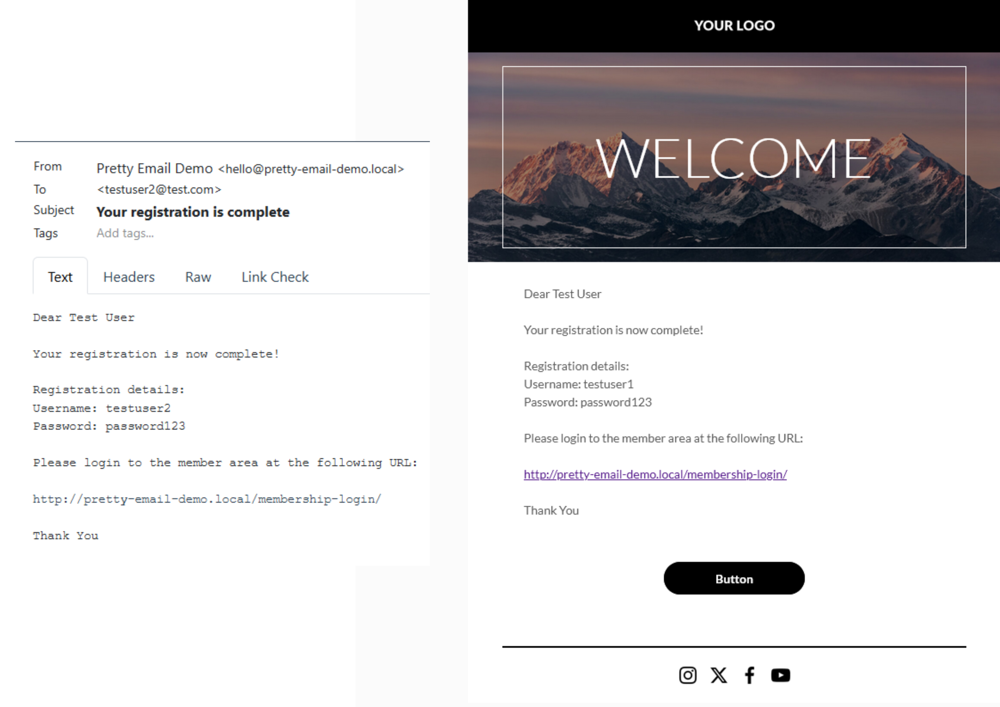
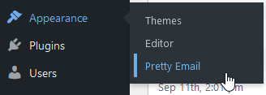
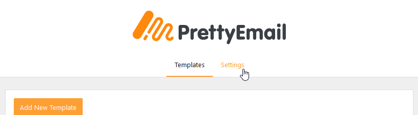
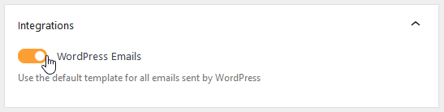
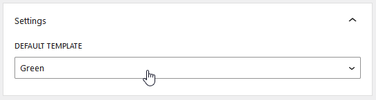
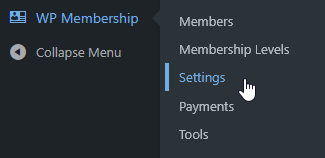
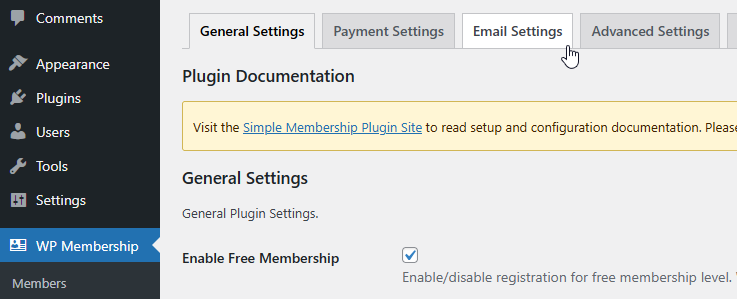
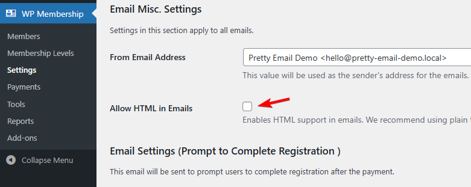

# Simple Membership

**Simple Membership email template customization** elevates your membership site communications from basic text notifications to polished, professional messages that reflect your brand's quality. While Simple Membership handles the complex membership management, Pretty Email ensures every registration confirmation, password reset, and member notification delivers a cohesive, branded experience that builds confidence and reinforces member value.

:::tip Quick Integration
Transform your membership site emails in just **5 minutes** following this streamlined setup process. Zero coding knowledge required!
:::

## Prerequisites

Before connecting Pretty Email with Simple Membership, verify you have:

- **Simple Membership** plugin installed and active
- **Pretty Email** plugin installed and active ([Setup Guide](../installation-and-license.md))
- WordPress 5.0 or higher running PHP 7.4+
- At least one membership level configured
- Administrator access to WordPress settings

:::info New to Pretty Email?
[Get Pretty Email](https://bracketspace.com/downloads/pretty-email/) and start creating beautiful email templates for your membership site today.
:::

## Understanding Simple Membership Email Format

Simple Membership uses plain text email format by default, which provides excellent email deliverability and seamless compatibility with Pretty Email. The plugin includes an optional "Allow HTML in Emails" setting, but **this should remain disabled** for Pretty Email integration to work correctly.

:::note Email Format Compatibility
Simple Membership sends plain text emails by default, making it fully compatible with Pretty Email without additional configuration. Pretty Email wraps these plain text notifications in your custom templates while preserving all member data and dynamic content.
:::

:::warning Important Setting
Do NOT enable the "Allow HTML in Emails" option in Simple Membership settings. This setting would prevent Pretty Email from wrapping your member notifications. Keep this option disabled for proper integration.
:::

## Step-by-Step Integration Guide

### 1. Activate Pretty Email for WordPress Emails

Configure Pretty Email to handle all WordPress-generated emails:

1. Go to **Appearance** → **Pretty Email**

   

2. Select the **Settings** tab

   

3. Activate **WordPress Emails** in the Integrations panel

   

### 2. Choose Your Default Template

Pick the email template design for your membership notifications:

1. In the **Settings** tab, find the **Default Template** selector
2. Choose your preferred template from available designs

   

:::note Email Body Block Required
The template you select must contain an **Email Body block** to properly display registration details, member information, password reset links, and other dynamic membership content.
:::

### 3. Verify Simple Membership Email Settings

Confirm your Simple Membership email configuration is optimized for Pretty Email:

1. Navigate to **WP Membership** → **Settings**

   

2. Click the **Email Settings** tab

   

3. **IMPORTANT**: Verify that **"Allow HTML in Emails"** checkbox is **UNCHECKED**

   

4. Configure your **Email From** address and name if needed
5. Save your settings

:::tip Email Deliverability
Simple Membership developers recommend keeping HTML emails disabled for better email deliverability rates. This recommendation aligns perfectly with Pretty Email integration requirements.
:::

### 4. Customize Email Content (Optional)

While Pretty Email handles visual design, you can customize message content in Simple Membership:

1. In **WP Membership** → **Settings** → **Email Settings**, scroll through various email type configurations:
   - **Registration Complete** - Welcome message for new members
   - **Email Activation** - Account activation instructions
   - **Password Reset** - Password recovery notifications
   - **Upgrade Complete** - Membership level upgrade confirmations
   - **Admin Notifications** - Member registration alerts for administrators

2. Edit subject lines and body content for each email type
3. Use Simple Membership merge tags like `{user_name}`, `{membership_level}`, `{email}`, `{login_link}`, and `{expiry_date}`
4. Save changes to update email content

:::info Merge Tags
Simple Membership uses curly brace syntax for dynamic variables like `{member_id}` and `{first_name}`. These merge tags work seamlessly with Pretty Email and will be replaced with actual member data in every notification.
:::

### 5. Test Your Email Integration

Always validate your setup functions correctly:

1. Create a test membership account or use an existing test member
2. Trigger different email types (registration, password reset, etc.)
3. Check recipient inboxes for templated notifications
4. Verify all member details and merge tags display accurately
5. Test across multiple email clients (Gmail, Outlook, Apple Mail, Yahoo)
6. View emails on both desktop and mobile devices

## Customization Options

### Brand Identity

Synchronize your membership emails with your brand aesthetics:

- **Logo Display**: Feature your brand logo prominently in email headers
- **Color Coordination**: Match your website's color scheme throughout emails
- **Font Consistency**: Apply your brand typography across all member communications
- **Layout Selection**: Choose from multiple professional template structures
- **Footer Elements**: Include social links, support information, or member resources

### Template Gallery

Browse beautifully designed preset templates built into Pretty Email, perfect for membership sites:

- Clean membership layouts
- Professional transactional templates
- Modern notification designs
- Customizable membership frameworks

## Troubleshooting Common Issues

### Emails Not Using Pretty Email Templates

**Problem**: Simple Membership notifications appear as plain text without Pretty Email styling.

**Solution**:
1. **Most Common Fix**: Verify "Allow HTML in Emails" is DISABLED in Simple Membership → Settings → Email Settings
2. Confirm WordPress Emails integration is enabled in Pretty Email settings
3. Check that a default template is selected in Pretty Email settings
4. Ensure your selected template includes an Email Body block
5. Clear WordPress caching and browser cache
6. Test with a fresh membership action (new registration, password reset, etc.)

### Member Information Missing from Emails

**Problem**: Member details or dynamic content aren't appearing in notifications.

**Solution**:
1. Verify the Email Body block exists in your Pretty Email template
2. Check that Simple Membership email templates use correct merge tag syntax (e.g., `{user_name}`, `{membership_level}`)
3. Ensure member account has all required fields populated
4. Test with a complete member profile including all custom fields

### Emails Failing to Deliver

**Problem**: Members aren't receiving email notifications.

**Solution**:
1. Verify Simple Membership email settings have valid From Name and From Email configured
2. Test WordPress email functionality with standard password reset
3. Install SMTP plugin like WP Mail SMTP or Post SMTP for reliable delivery
4. Check spam/junk folders for test emails
5. Review server email logs for delivery errors
6. Confirm membership level has email notifications enabled

### Template Display Issues

**Problem**: Emails render incorrectly in specific email applications.

**Solution**:
1. Test across multiple email clients (Gmail web, Outlook, Apple Mail, Yahoo)
2. Use standard web-safe fonts for universal compatibility
3. Simplify complex layouts for better email client rendering
4. Ensure images are properly hosted and publicly accessible
5. Avoid advanced CSS features that email clients may strip

### Specific Email Types Not Templated

**Problem**: Only certain Simple Membership notification types use Pretty Email templates.

**Solution**:
1. Verify WordPress Emails integration covers all membership emails sent through `wp_mail()`
2. Confirm "Allow HTML in Emails" remains disabled for ALL email types
3. Clear any email caching in Simple Membership or other plugins
4. Check for plugin conflicts by temporarily disabling other plugins

## Frequently Asked Questions

**Q: Why aren't my Simple Membership emails displaying with Pretty Email templates?**

A: The most common issue is having "Allow HTML in Emails" enabled in Simple Membership settings. Navigate to WP Membership → Settings → Email Settings and ensure this checkbox is UNCHECKED. Simple Membership sends plain text emails by default, which Pretty Email wraps beautifully. Enabling HTML emails prevents this integration.

**Q: Can I use different templates for different membership email types?**

A: The WordPress integration applies one default template to all Simple Membership emails. For advanced template assignment based on specific triggers or membership levels, consider using our [Notification plugin integration](notification.md) which allows you to create conditional triggers and assign different templates per notification type.

**Q: Does this work with Simple Membership premium add-ons?**

A: Yes, Pretty Email processes all emails sent through WordPress's email system, including those from Simple Membership add-ons and extensions. As long as the add-on uses Simple Membership's email functions or WordPress's `wp_mail()`, Pretty Email will style the notifications automatically.

**Q: Can I still use Simple Membership's merge tags?**

A: Absolutely! Simple Membership's dynamic merge tags like `{user_name}`, `{membership_level}`, `{expiry_date}`, and `{login_link}` work perfectly with Pretty Email. Pretty Email wraps your content while preserving all dynamic functionality and variable replacements.

**Q: Does this affect membership functionality or payment processing?**

A: No, Pretty Email only handles the visual presentation of emails. All Simple Membership functionality including member registration, content protection, payment processing, membership levels, and access control remains completely unchanged.

**Q: What happens to Simple Membership's built-in email content?**

A: Simple Membership's email content (subject lines, body text, merge tags) is preserved and wrapped in your Pretty Email template design. The content you configure in Simple Membership email settings will appear within the Email Body block of your Pretty Email template.

**Q: Can I add promotional content to membership emails?**

A: Yes! Pretty Email templates support custom blocks where you can add promotional banners, upgrade opportunities, member benefits information, social media links, or community highlights alongside membership notifications.

**Q: Will this work with email activation and account approval emails?**

A: Yes, Pretty Email styles all Simple Membership emails including email activation confirmations, account approval notifications, password resets, upgrade confirmations, and administrative alerts. All member-related communications will use your branded template.

## Related Resources

### Other Membership & Subscription Integrations
- [WooCommerce Email Templates](woocommerce.md) - E-commerce and subscription emails
- [WordPress Default Emails](wordpress.md) - Core WordPress email customization
- [bbPress Forum Templates](bbpress.md) - Community forum email styling

### Template Design Resources
- [Creating New Templates](../composing-templates/creating-new-template.md) - Build custom email designs
- [Template Blocks Guide](../composing-templates/composing-templates-with-blocks.md) - Understanding email components
- [Global Template Settings](../composing-templates/global-template-settings/index.md) - Brand consistency configuration

### Additional Support
Need assistance integrating Pretty Email with Simple Membership? [Contact our support team](mailto:support@bracketspace.com) for personalized help with your membership site email template configuration.

:::tip Best Practice
When customizing Simple Membership email content, focus on clear, concise messaging about membership benefits, access instructions, and next steps. The Pretty Email template automatically provides visual polish and branding, allowing you to keep email body content action-focused and member-centric. Use Simple Membership's merge tags to personalize each communication with member-specific information.
:::

## Sources

- [Simple Membership – WordPress plugin | WordPress.org](https://wordpress.org/plugins/simple-membership/)
- [Simple Membership Documentation - Membership Plugin](https://simple-membership-plugin.com/simple-membership-documentation/)
- [Simple Membership Email Notification and Broadcast Addon](https://simple-membership-plugin.com/simple-membership-email-notification-broadcast-addon/)
- [Send a Quick Notification Email To Your Members](https://simple-membership-plugin.com/send-a-quick-notification-email-to-your-members/)
