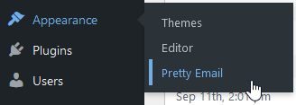
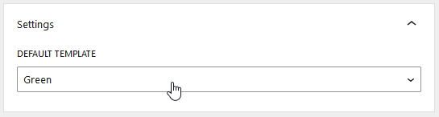

# The Events Tickets

**Events Ticket email customization** elevates your customer experience from the moment of purchase. Pretty Email integration with The Events Tickets plugin replaces generic ticket confirmations with polished, professional communications that reflect your brand and build engagement.

<!-- TODO: Add screenshot - the-events-tickets-before-after-comparison.png -->
<!--  -->

:::tip Rapid Implementation
Transform your ticket confirmation emails in approximately **7 minutes** following the configuration steps outlined below. Zero development skills necessary!
:::

## Prerequisites

Before connecting Pretty Email with your ticketing system, confirm you have:

- **The Events Tickets** plugin (by StellarWP) installed and running
- **Pretty Email** plugin installed and active ([Installation Instructions](../installation-and-license.md))
- WordPress 5.0 minimum with PHP 7.4 or newer
- At least one ticketed configured in your system
- Basic understanding of ticketing workflow

:::info Haven't installed Pretty Email?
[Access Pretty Email](https://bracketspace.com/downloads/pretty-email/) to begin crafting memorable ticket email experiences.
:::

## Step-by-Step Integration Guide

### 1. Activate Pretty Email for WordPress Notifications

Begin by enabling Pretty Email to process WordPress system emails (which Event Tickets notifications utilize):

1. Access **Appearance** → **Pretty Email** in your WordPress dashboard

   

2. Select the **Settings** section

   

3. Enable **WordPress Emails** from the Integrations panel

   

### 2. Choose Your Template Design

Configure which template will enhance your ticket confirmation emails:

1. Within the **Settings** tab, locate the **Default Template** selector
2. Pick your desired email template from available options

   

:::note Email Content Block Essential
Your selected template must contain an **Email Body block** to properly display ticket confirmation details and related information.
:::

:::warning Template Applies Site-Wide
The WordPress Emails integration applies your chosen default template to **all plain text emails** sent from your WordPress site, not just Event Tickets notifications. This includes emails from WordPress core, plugins, and themes. If you need different templates for different email types, consider using a plugin with dedicated Pretty Email integration like Gravity Forms or WooCommerce.
:::

### 3. Configure Event Ticket Settings

Optimize your Event Tickets configuration for seamless email delivery:

1. Navigate to **Tickets** → **Settings**

   

2. Open the **Emails** tab
3. Review email notification settings for ticket confirmations

   <!-- TODO: Add screenshot - event-tickets-email-settings.png -->
   <!--  -->

4. Verify recipient addresses and notification triggers are configured correctly

### 4. Test Your Email Integration

Critical testing ensures flawless attendee experience:

1. Purchase a test ticket from your event, post, or page where tickets are available

   <!-- TODO: Add screenshot - event-tickets-purchase-form.png -->
   <!--  -->

2. Inspect the received confirmation email formatting

   <!-- TODO: Add screenshot - event-tickets-confirmation-email-example.png -->
   <!--  -->

3. Confirm all ticket details display accurately in the email
4. Check email appearance across mobile and desktop platforms
5. Verify all embedded links (view ticket, purchase details) function correctly
6. Test with various ticket quantities and types

## Customization Options

### Ticket Email Branding

Craft ticket emails that embody your brand identity:

- **Logo**: Display your organization or brand logo prominently in email headers
- **Theme Colors**: Incorporate your brand's signature color scheme throughout emails
- **Custom Typography**: Apply distinctive fonts that match your marketing materials
- **Layout Variations**: Select template structures that complement your brand style
- **Additional Information**: Highlight relevant details with custom-designed sections
- **Social Media Integration**: Add your social channels for continued engagement

### Template Design

Create custom email templates using our powerful block-based editor:

- Start with preset template patterns or build from scratch
- Combine blocks to create layouts that match your brand
- Customize colors, fonts, and spacing to fit your style
- Learn more in our [template creation guide](../composing-templates/creating-new-template.md)

## Troubleshooting Common Issues

### Confirmation Emails Not Delivered

**Problem**: Ticket purchasers aren't receiving Pretty Email formatted confirmations.

**Solution**:
1. Verify WordPress Emails integration is active in Pretty Email
2. Check your hosting environment supports email transmission
3. Configure an SMTP plugin (WP Mail SMTP or similar) for enhanced deliverability
4. Examine spam folders and email filtering rules
5. Test ticket purchase with multiple email providers (Gmail, Outlook, etc.)

### Standard Format Instead of Custom Template

**Problem**: Ticket confirmation emails arrive without Pretty Email styling applied.

**Solution**:
1. Confirm your template includes the Email Body block
<!-- TODO: Review after dev work - verify correct email format setting for Event Tickets integration -->
2. Verify plain text email format is enabled in Event Tickets settings
3. Check that default template selection is properly saved
4. Clear WordPress cache and any caching plugins
5. Deactivate conflicting email plugins temporarily for testing

### Ticket Details Not Appearing

**Problem**: Ticket information is absent from confirmation emails.

**Solution**:
1. Ensure Email Body block is positioned correctly in your template
2. Verify Event Tickets notification templates haven't been customized to remove data
3. Check that ticket fields and details are properly configured on your post/page/event
4. Test with a fresh ticket purchase

### Template Design Inconsistencies

**Problem**: Emails display incorrectly in certain email applications.

**Solution**:
1. Test across major email clients (Gmail, Outlook, Yahoo Mail, Apple Mail)
2. Simplify complex design elements for broader compatibility
3. Utilize web-safe fonts and standard color formats
4. Keep layouts straightforward using table-based structures
5. Review mobile responsiveness with actual device testing

### Multiple Tickets Formatting Issues

**Problem**: Emails with multiple tickets or attendees display poorly.

**Solution**:
1. Test templates with various ticket quantities before going live
2. Ensure Email Body block accommodates dynamic content expansion
3. Check Event Tickets settings for multi-attendee email configuration
4. Simplify template layout if complex designs cause rendering issues

## Frequently Asked Questions

**Q: Can I use different templates for different tickets or content types?**

A: No. The WordPress Emails integration applies one default template to **all plain text emails** on your WordPress site, including Event Tickets notifications, WordPress core emails, and emails from other plugins. You cannot assign different templates to specific tickets, posts, pages, or content types. For more granular template control, consider plugins with dedicated Pretty Email integrations like [Gravity Forms](gravity-forms.md) or [WooCommerce](woocommerce.md).

**Q: Does this work with Event Tickets Plus and other extensions?**

A: Yes, Pretty Email processes the final email output from The Events Tickets ecosystem, including Event Tickets Plus and most compatible extensions. We recommend testing with your specific add-on configuration.

**Q: Will templated emails affect ticket delivery reliability?**

A: Pretty Email handles presentation only and doesn't impact delivery infrastructure. For improved inbox placement, pair Pretty Email with professional SMTP services like Postmark or SendLayer.

**Q: Can I include images and banners in confirmation emails?**

A: Absolutely! Pretty Email templates support image blocks where you can showcase photography, logos, promotional graphics, or any custom imagery alongside ticket confirmation details.

**Q: Is there a method to preview confirmation emails before going live?**

A: You can preview template designs within the Pretty Email editor. For complete ticket confirmation testing with actual data, purchase test tickets from your draft content or use test mode in your payment gateway.

**Q: What happens to QR codes and ticket attachments?**

A: Pretty Email wraps the email content but doesn't interfere with ticket attachments or QR code functionality. These elements from The Events Tickets plugin will continue working as configured.

## Related Resources

### Integration Guides
- [WooCommerce Templates](woocommerce.md) - E-commerce notification styling (works with Event Tickets Commerce)
- [Gravity Forms Integration](gravity-forms.md) - Custom registration form emails
- [WordPress System Emails](wordpress.md) - Platform-wide email customization

### Design Resources
- [Creating Custom Templates](../composing-templates/creating-new-template.md) - Build custom email designs
- [Understanding Blocks](../composing-templates/composing-templates-with-blocks.md) - Email component library
- [Global Design Settings](../composing-templates/global-template-settings/index.md) - Brand consistency management

### Support Channel
Questions about Event Tickets email integration? [Contact our support specialists](mailto:support@bracketspace.com) for personalized guidance on your ticket email template configuration.

:::tip Ticket Email Best Practices
First impressions matter! Design confirmation emails that generate excitement and clearly communicate essential ticket details. Include prominent calls-to-action for accessing tickets, relevant information links, and sharing options to maximize engagement.
:::
