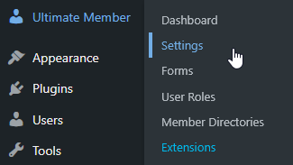
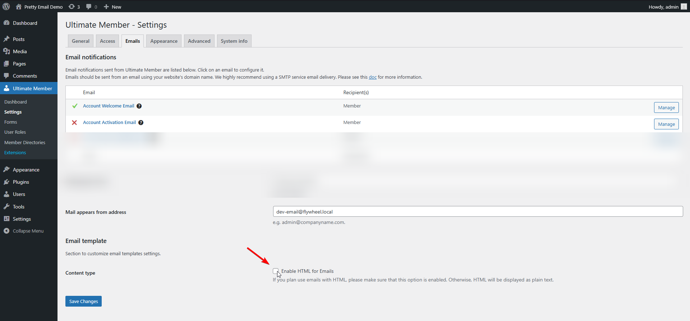

# Ultimate Member

**Ultimate Member email template customization** elevates your membership site's communications from plain text to polished, professional messages that reflect your brand. While Ultimate Member excels at building user profiles and managing memberships, Pretty Email ensures every registration welcome, password reset, and profile notification reinforces your community's identity and professionalism.

<!-- TODO: Add screenshot - ultimate-member-before-after-comparison.jpg -->
<!--  -->

:::tip Fast Integration
Transform your membership site emails in approximately **7 minutes** using this straightforward integration walkthrough. Zero coding knowledge necessary!
:::

## Prerequisites

Before connecting Pretty Email with Ultimate Member, verify you have:

- **Ultimate Member** plugin installed and active
- **Pretty Email** plugin installed and active ([Setup Guide](../installation-and-license.md))
- WordPress 5.0+ running PHP 7.4 or higher
- At least one Ultimate Member form configured (registration, login, or profile)
- Basic understanding of Ultimate Member settings

:::info Getting Started with Pretty Email?
[Download Pretty Email](https://bracketspace.com/downloads/pretty-email/) to begin crafting professional email templates for your membership site communications.
:::

## Step-by-Step Integration Guide

### 1. Activate Pretty Email for WordPress Emails

Enable Pretty Email to process WordPress default emails (which encompasses Ultimate Member notifications):

1. Go to **Appearance** → **Pretty Email**

   

2. Select the **Settings** tab

   

3. Turn on **WordPress Emails** within the Integrations section

   

### 2. Select Your Email Template Design

Pick the template layout for your Ultimate Member notifications:

1. Still in the **Settings** tab, find the **Default Template** selection menu
2. Choose your desired email template design from available options

   

:::note Email Body Block Essential
Your chosen template must contain an **Email Body block** to correctly render user notifications and dynamic content from Ultimate Member.
:::

### 3. Disable HTML Emails in Ultimate Member

Ultimate Member enables HTML emails by default, which Pretty Email cannot wrap. You must disable this setting to allow Pretty Email template integration:

1. Navigate to **Ultimate Member** → **Settings**

   

2. Go to the **Email** tab
3. Locate the **"Enable HTML for Emails"** checkbox

   

4. **Uncheck** this checkbox to disable HTML emails
5. Click **Save Changes**

:::warning Critical Configuration Step
Ultimate Member sends HTML emails by default. You **must uncheck** the "Enable HTML for Emails" checkbox in Ultimate Member → Settings → Email for Pretty Email integration to work. When HTML emails are enabled, Ultimate Member wraps emails in its own HTML structure, which Pretty Email cannot process. Only plain text emails can be wrapped in Pretty Email templates.
:::

### 4. Customize Email Content (Optional)

While your Pretty Email template handles the visual design, you can customize the message content within Ultimate Member:

1. Within each email notification settings in **Ultimate Member** → **Settings** → **Email**
2. Edit the message body using plain text format
3. Utilize Ultimate Member's dynamic placeholders (e.g., `{username}`, `{site_name}`, `{password_reset_link}`)
4. Keep content concise - the template provides the visual structure

:::warning Do Not Use HTML Tags in Email Content
When HTML emails are disabled, Ultimate Member automatically strips all HTML tags from your email content before sending. If you write `
Welcome <strong>{'{username}'}</strong>!
`, it will be sent as plain text: "Welcome {'{username}'}!" with all HTML tags removed but placeholders preserved. Do not add HTML formatting like `
`, `<strong>`, `<a>`, or ` ` in your email messages - the Pretty Email template handles all visual styling. Focus on writing clear, plain text content with Ultimate Member's placeholders.
:::

### 5. Test Your Email Integration

Always validate your configuration functions as expected:

1. Create a test user account through your registration form
2. Verify the welcome email arrives with Pretty Email styling
3. Test password reset functionality and confirm templated email delivery
4. Check all dynamic placeholders populate correctly
5. Review emails on various devices (desktop, mobile, tablet)
6. Test across multiple email clients (Gmail, Outlook, Apple Mail, Yahoo)

## Customization Options

### Brand Alignment

Synchronize your membership emails with your brand aesthetic:

- **Logo Display**: Feature your community or organization logo in email headers
- **Color Palette**: Implement your brand colors throughout email templates
- **Typography**: Maintain consistent font choices across all member communications
- **Layout Structure**: Select from various professional template arrangements
- **Footer Elements**: Incorporate social media links, community guidelines, or contact details

### Template Design Options

Browse our [template gallery](../composing-templates/creating-new-template.md) for membership-focused designs:

- Professional community layouts
- Modern membership templates
- Clean notification styles
- Customizable design frameworks

## Troubleshooting Common Issues

### Emails Not Using Pretty Email Templates

**Problem**: Ultimate Member notifications continue appearing in default plain text format without Pretty Email styling.

**Solution**:
1. **Most Common Fix**: Verify the "Enable HTML for Emails" checkbox is **unchecked** in Ultimate Member → Settings → Email
2. Confirm WordPress Emails integration is enabled in Pretty Email settings
3. Check that a default template is selected in Pretty Email settings
4. Ensure your template includes an Email Body block
5. Clear WordPress caching if using cache plugins
6. Send a fresh test notification after configuration changes

### User Information Not Appearing

**Problem**: Dynamic user details (names, usernames, links) aren't displaying in emails.

**Solution**:
1. Verify the Email Body block is present in your Pretty Email template
2. Confirm Ultimate Member email content uses proper placeholder syntax
3. Check that user profile fields are correctly configured
4. Test with a complete registration including all required fields

### Emails Failing to Send

**Problem**: Members aren't receiving any email notifications.

**Solution**:
1. Verify Ultimate Member email notifications are enabled for each type
2. Test your WordPress site can send emails (try password reset from wp-login.php)
3. Install SMTP plugin like WP Mail SMTP or Post SMTP for reliable delivery
4. Check email addresses are valid in Ultimate Member settings
5. Review spam/junk folders for test emails
6. Check server email logs for delivery errors

### Emails Have HTML Styling Instead of Pretty Email Templates

**Problem**: Ultimate Member emails display with HTML styling instead of Pretty Email templates.

**Solution**:
1. **Primary Fix**: Verify the "Enable HTML for Emails" checkbox is **unchecked** in Ultimate Member → Settings → Email tab (this is a global setting affecting all Ultimate Member emails)
2. Some Ultimate Member extensions may send their own emails - check if extensions have separate email format settings
3. Clear any WordPress object caching after making changes
4. Verify no other email plugins are interfering with Ultimate Member emails

### Template Rendering Problems

**Problem**: Emails display incorrectly in specific email applications.

**Solution**:
1. Test across diverse email clients (Gmail web, Outlook desktop, Apple Mail, Yahoo)
2. Utilize standard web-safe fonts for maximum compatibility
3. Simplify elaborate layouts for universal email client rendering
4. Confirm images are properly hosted and publicly accessible
5. Avoid CSS features that email clients commonly strip

## Frequently Asked Questions

**Q: Why aren't my Ultimate Member emails displaying with Pretty Email templates?**

A: Ultimate Member enables HTML emails by default, which prevents Pretty Email from wrapping them. You need to navigate to Ultimate Member → Settings → Email tab and **uncheck** the "Enable HTML for Emails" checkbox. This is a required configuration step for Pretty Email integration to work.

**Q: Can I use different templates for different notification types?**

A: Currently, the WordPress integration applies a single default template to all plain text emails from Ultimate Member. For more advanced template control based on notification triggers, consider using our [Notification plugin integration](notification.md) which enables you to assign specific templates to different user events.

**Q: Does this work with Ultimate Member premium extensions?**

A: Yes, Pretty Email processes the final email output, so it works with Ultimate Member extensions. As long as the global "Enable HTML for Emails" setting is disabled, all emails including those from extensions will be styled with Pretty Email templates. Some extensions may have their own separate email settings.

**Q: Can I still use Ultimate Member's email placeholders?**

A: Absolutely! Ultimate Member's dynamic placeholders like `{username}`, `{site_name}`, `{account_activation_link}`, etc. work perfectly with Pretty Email. Pretty Email wraps your plain text email content while preserving all dynamic functionality and placeholder replacements.

**Q: Does this affect user account activation links?**

A: No, all Ultimate Member functionality remains intact. Activation links, password reset links, and other dynamic URLs work exactly as before - they just appear within your beautifully styled Pretty Email template.

**Q: What happens if I keep HTML emails enabled in Ultimate Member?**

A: Pretty Email specifically wraps plain text emails. If you keep the "Enable HTML for Emails" option enabled (Ultimate Member's default), emails will not be wrapped in Pretty Email templates and will use Ultimate Member's built-in HTML styling instead. You must disable HTML emails for Pretty Email integration to function.

**Q: Can I add images to my membership notification emails?**

A: Yes, you can incorporate images, logos, and graphics into your Pretty Email templates. These images will appear in all templated Ultimate Member notifications.

**Q: Will this work with custom user roles and profile fields?**

A: Yes, Pretty Email works with all Ultimate Member features including custom roles, conditional profile fields, and member directories. The integration focuses on email presentation without affecting Ultimate Member's functionality.

## Related Resources

### Other Membership & Community Integrations
- [bbPress Forum Templates](bbpress.md) - Community forum email customization
- [WooCommerce Email Templates](woocommerce.md) - E-commerce membership notifications
- [WordPress Default Emails](wordpress.md) - Core WordPress email styling

### Template Design Resources
- [Building New Templates](../composing-templates/creating-new-template.md) - Create custom email layouts
- [Understanding Template Blocks](../composing-templates/composing-templates-with-blocks.md) - Email component fundamentals
- [Global Template Settings](../composing-templates/global-template-settings/index.md) - Consistent branding configuration

### Additional Support
Experiencing difficulties integrating Pretty Email with Ultimate Member? [Contact our support team](mailto:support@bracketspace.com) for personalized assistance with your membership site email configuration.

:::tip Best Practice
After disabling HTML emails in Ultimate Member, focus your email content on essential information and clear messaging. The Pretty Email template automatically provides visual appeal and branding, allowing you to keep notification messages concise and action-focused. Use Ultimate Member's placeholders like `{username}`, `{site_name}`, and `{login_url}` to personalize each communication efficiently.
:::
