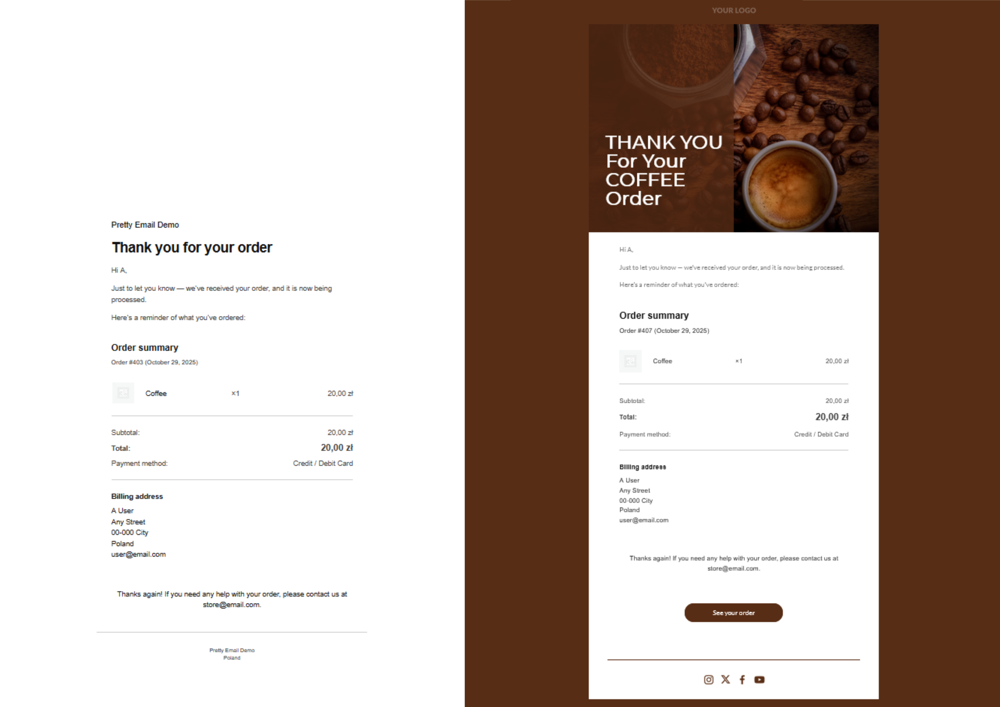
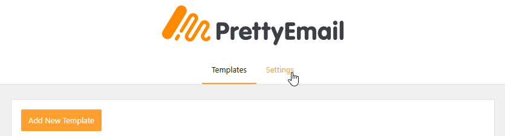
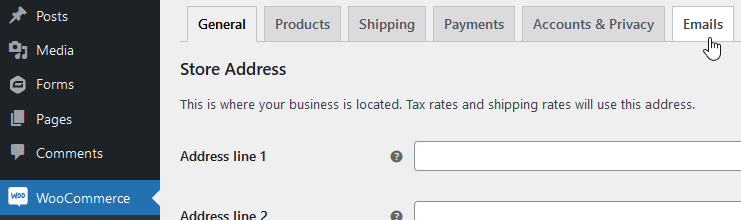
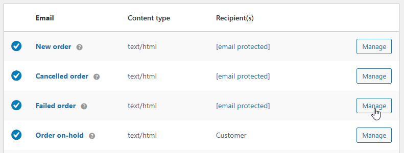
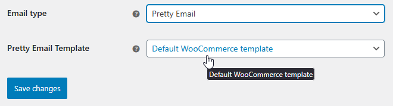

# WooCommerce

**WooCommerce email template customization** with Pretty Email lets you create professional, branded order notifications and customer communications. Transform your store's email experience with beautiful, responsive email designs.

:::tip Quick Integration
Elevate your WooCommerce store emails in under **10 minutes** with our comprehensive setup guide below. No technical expertise needed!
:::

## Prerequisites

Before connecting Pretty Email with your WooCommerce store, make sure you have:

- **WooCommerce plugin** installed and activated on your WordPress site
- **Pretty Email plugin** installed and active ([Setup Instructions](../installation-and-license.md))
- WordPress 5.0 or higher with PHP 7.4+
- At least one active WooCommerce email notification configured
- Basic familiarity with WooCommerce email settings

:::info New to Pretty Email?
[Get Pretty Email](https://bracketspace.com/downloads/pretty-email/) and transform your ecommerce email communications with professional template designs.
:::

## Step-by-Step Integration Guide

Turning on Pretty Email for WooCommerce emails:

1.  Go to `Appearance` -> `Pretty Email`

    

2.  Navigate to `Settings` tab

    

3.  Enable WooCommerce integration:

    

4.  Select default template for WooCommerce emails:

    

5.  Then go to `WooCommerce` -> `Settings` -> `Emails`

    

6.  Manage chosen emails to turn on Pretty Emails email type for them:

    

7.  You can leave the default WooCommerce email template, or choose a specific one for each email separately:

    

8.  Verify your integration by testing:

    - Place a test order on your WooCommerce store
    - Check the recipient inbox for the templated notification
    - Confirm all order details (products, prices, totals) display correctly
    - Test email rendering on both mobile devices and desktop clients
    - Verify links (view order, reset password, etc.) function properly

:::note
All `plain-text` emails are wrapped in Pretty Email templates, while HTML emails are not.
:::

So, if you change the WC email type to `plain-text` , expect the PE template to be applied to this email as well. However, the email content will be formatted better when you use proper PE integration outlined above.

## Customization Options

### Store Branding

Align your WooCommerce emails with your brand identity:

- **Logo Placement**: Feature your store logo prominently in email headers
- **Brand Colors**: Match your website's color scheme for consistent recognition
- **Custom Fonts**: Apply your brand typography across all customer communications
- **Email Layouts**: Select from multiple template structures to suit your store style
- **Social Links**: Include branded social media icons linking to your brand profiles

### Template Collection

Explore our [template showcase](../composing-templates/creating-new-template.md) for ready-made designs and inspiration:

- E-commerce optimized layouts
- Clean transactional templates
- Product-focused designs
- Minimal professional styles

## Troubleshooting Common Issues

### Templates Not Applied to Order Emails

**Problem**: WooCommerce order notifications remain in default format without Pretty Email styling.

**Solution**:
1. Confirm WooCommerce integration is activated in Pretty Email settings
2. Check that a default template is selected for WooCommerce in Pretty Email settings
3. Double-check that the specific email type (e.g., "New Order", "Completed Order") has Pretty Email enabled individually
4. Verify the email type is set to `Pretty Email` or `plain-text` in WooCommerce email settings (HTML emails are not wrapped)
5. Ensure your selected templates contain the Email Body block
6. Test by placing a new order to trigger email notifications

### Order Details Missing from Emails

**Problem**: Customer order information isn't showing up in templated emails.

**Solution**:
1. Verify the Email Body block exists in your Pretty Email template
2. Check WooCommerce email settings haven't been customized to remove content
3. Confirm WooCommerce placeholders are properly formatted
4. Test with a fresh order to ensure data is being captured

### Design Breaking in Email Clients

**Problem**: WooCommerce emails look incorrect in certain email applications.

**Solution**:
1. Test across multiple clients (Gmail, Outlook, Yahoo, Apple Mail)
2. Avoid complex CSS that may be stripped by email clients
3. Use standard web-safe fonts for better compatibility
4. Keep layouts simple and table-based for reliable rendering

### Specific Email Types Not Templated

**Problem**: Only some WooCommerce notification types use Pretty Email templates.

**Solution**:
1. Enable Pretty Email individually for each WooCommerce email type you want styled
2. Navigate to WooCommerce → Settings → Emails and configure each email separately
3. Set email type to `Pretty Email` for each notification you want templated
4. Verify that custom email types from extensions are compatible

## Frequently Asked Questions

**Q: Can I assign unique templates to different WooCommerce email types?**

A: Absolutely! You can select specific Pretty Email templates for each WooCommerce notification type (New Order, Processing Order, Completed Order, etc.) by configuring them individually in WooCommerce → Settings → Emails.

**Q: Will this integration work with WooCommerce extensions and add-ons?**

A: Pretty Email is compatible with most WooCommerce extensions since it processes the final email content. Custom notification types from premium add-ons should work, though we recommend testing each new extension.

**Q: Does Pretty Email affect my store's transactional email deliverability?**

A: Pretty Email focuses on design and presentation without impacting delivery infrastructure. For optimal deliverability, pair it with a reliable SMTP service like SendLayer, Amazon SES, or Brevo.

**Q: Can I add promotional content to my WooCommerce order emails?**

A: Yes! Pretty Email templates support custom blocks where you can insert promotional banners, product recommendations, social media links, or special offers alongside order details.

**Q: How do I preview WooCommerce emails before customers receive them?**

A: You can preview your template design in the Pretty Email editor. For complete order email testing with actual WooCommerce data, place test orders or use WooCommerce's built-in email preview functionality.

**Q: What happens to HTML-formatted WooCommerce emails?**

A: Pretty Email only wraps plain-text WooCommerce emails. If your WooCommerce email is set to HTML format, it will bypass Pretty Email templating and send using WooCommerce's default HTML template.

## Related Resources

### Additional Integrations
- [Gravity Forms Integration](gravity-forms.md) - Advanced form notification templates
- [Contact Form 7 Templates](contact-form-7.md) - Contact form email customization
- [WordPress System Emails](wordpress.md) - Default WordPress email styling

### Template Development
- [Building New Templates](../composing-templates/creating-new-template.md) - Design custom email layouts
- [Working with Blocks](../composing-templates/composing-templates-with-blocks.md) - Email block components
- [Global Configuration](../composing-templates/global-template-settings/index.md) - Consistent branding settings

### Support Resources
Need help with WooCommerce email customization? [Reach out to our support team](mailto:support@bracketspace.com) for dedicated assistance with your store's email template configuration.

:::tip Optimization Tip
For transactional emails, keep designs clean and order details prominent. Save elaborate promotional designs for marketing campaigns to ensure customers can quickly find their order information.
:::