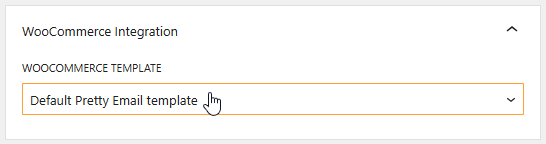
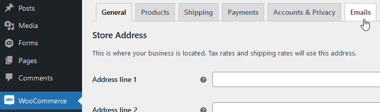
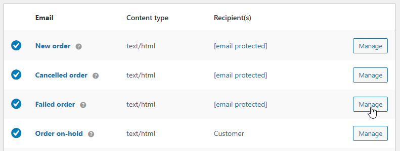

# WooCommerce

Turning on Pretty Email for WooCommerce emails:

1.  Go to `Appearance` -> `Pretty Email`

    

2.  Navigate to `Settings` tab

    

3.  Enable WooCommerce integration:

    

4.  Select default template for WooCommerce emails:

    

5.  Then go to `WooCommerce` -> `Settings` -> `Emails`

    

6.  Manage chosen emails to turn on Pretty Emails email type for them:

    

7.  You can leave the default WooCommerce email template, or choose a specific one for each email separately:

    

:::danger
All `plain-text` emails are wrapped in Pretty Email templates, while HTML emails are not.
:::

So, if you change the WC email type to `plain-text` , expect the PE template to be applied to this email as well. However, the email content will be formatted better when you use proper PE integration outlined above.