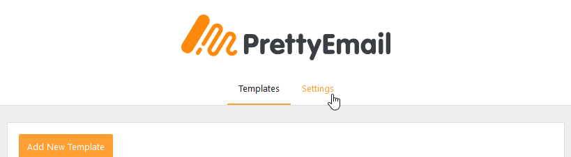
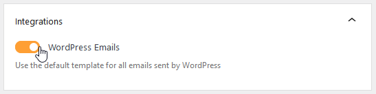

# WordPress

To turn on Pretty Email for WordPress emails:

1.  Go to `Appearance` -> `Pretty Email`

    

2.  Navigate to `Settings` tab

    

3.  Select the default email template (it will be applied for all emails unless otherwise specified)

    

4.  Turn on WordPress Emails in `Integrations` box

    

:::note
The chosen email template will be used for all WordPress default emails, so to keep their email content in it, an Email Body block must be placed in the chosen template.
:::

:::note
All `plain-text emails` are wrapped in Pretty Email templates, while HTML emails are not.
:::

:::warning
If the WordPress Emails option is turned on, `plain-text` emails sent by other plugins may also have a Pretty Email template applied.
:::