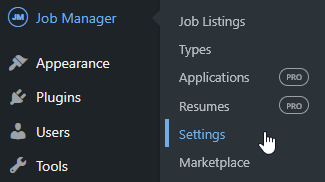
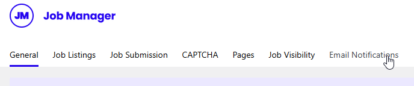
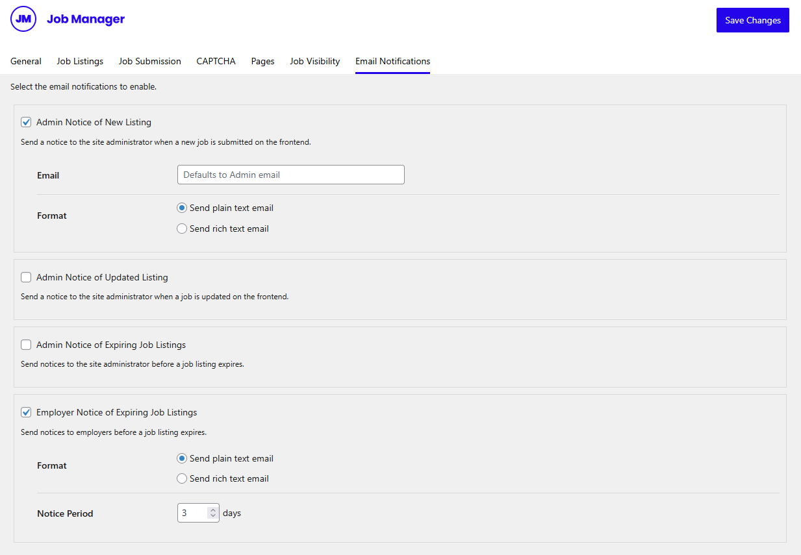

# WP Job Manager

**WP Job Manager email customization** enables you to transform job board notifications into polished, professional communications that reflect your brand and enhance the recruitment experience. Pretty Email works seamlessly with WP Job Manager to elevate job listing alerts, expiry notifications, resume submissions, and job alert emails with visually appealing email designs that engage employers, candidates, and subscribers while maintaining consistency across all touchpoints.

:::tip Quick Integration
Upgrade your job board emails in approximately **7 minutes** following our detailed integration steps below. Works with WP Job Manager core and premium add-ons.
:::

## Prerequisites

Before connecting Pretty Email with WP Job Manager, verify you have:

- **WP Job Manager plugin** (free or with premium add-ons) installed and activated on your site
- **Pretty Email plugin** installed and active ([Setup Guide](../installation-and-license.md))
- WordPress 5.0+ with PHP 7.4 or newer
- At least one job listing published or in draft status
- Familiarity with your WP Job Manager settings

:::info WP Job Manager Ecosystem
Pretty Email automatically styles plain text email notifications from WP Job Manager core and premium add-ons. This includes job listing notifications, resume submissions (Resume Manager), and job alerts (Job Alerts). Simply enable WordPress Emails integration and configure notifications to send as plain text.
:::

:::info New to Pretty Email?
[Download Pretty Email](https://bracketspace.com/downloads/pretty-email/) to start creating professional email templates for your WordPress job board today.
:::

## Step-by-Step Integration Guide

### 1. Activate Pretty Email for WordPress Emails

Enable Pretty Email to handle WordPress default emails (which includes WP Job Manager notifications):

1. Navigate to **Appearance** → **Pretty Email**

   

2. Access the **Settings** tab

   

3. Enable **WordPress Emails** in the Integrations section

   

### 2. Choose Your Email Template

Select the template design for your WP Job Manager notifications:

1. Within the **Settings** tab, locate the **Default Template** dropdown menu
2. Choose your preferred email template design

   

:::note Required Email Body Block
Your selected template must contain an **Email Body block** to properly display job listing content and notification messages.
:::

### 3. Configure core WP Job Manager Settings

Optimize your job board settings for enhanced email delivery:

1. Go to **Job Manager** → **Settings**

   

2. Navigate to the **Email Notifications** tab

   

3. Configure notification preferences for each email type you want to style with Pretty Email:

   

   For each notification (e.g., "Admin New Job", "Employer Expiring Job"):
   - **Enable** the notification checkbox
   - Click to expand the notification settings
   - **Format**: Select **"Send plain text email"** (required for Pretty Email to apply templates)
   - Configure other options like email recipient and expiry notice days as needed

:::warning Important
Pretty Email only wraps **plain text** emails in templates. You must select **"Send plain text email"** in the Format setting for each notification you want to style with Pretty Email. Rich text emails will not be wrapped in Pretty Email templates.
:::

:::info Premium Add-ons Settings
If you're using premium add-ons like Resume Manager (settings at **Resumes > Settings > Email Notifications**) or Job Alerts, note that each add-on may have its own settings location. Check your add-on's documentation to find where to configure email notifications and set them to plain text format.
:::

### 4. Test Your Integration

Always verify your setup works correctly before relying on it:

1. Submit a test job listing from the frontend submission form (or perform other actions that trigger your enabled notifications)
2. Check the admin email inbox for the styled notification
3. Verify job details display accurately in the template
4. Test expiry notifications by adjusting a job's expiration date
5. Preview emails across various email clients (Gmail, Outlook, Apple Mail)

## Understanding WP Job Manager Email Types

Pretty Email enhances WP Job Manager email notifications by wrapping plain text emails in your branded templates. Configure each notification to send as plain text format in your WP Job Manager settings for Pretty Email styling.

### Core Plugin Notifications (Free)

The free WP Job Manager plugin includes four essential email notification types:

- **Admin New Job** - Alerts administrators when someone submits a new job posting, includes approval links for pending listings
- **Admin Updated Job** - Notifies administrators when an employer modifies an existing job posting
- **Admin Expiring Job** - Warns administrators of upcoming job expirations for proactive renewal outreach
- **Employer Expiring Job** - Alerts employers before their job listings expire to encourage renewals

### Premium Add-on Notifications

WP Job Manager's premium add-ons expand your job board with additional notification types that work with Pretty Email:

**Resume Manager Add-on:**
- Integrates through **Resumes > Settings > Email Notifications**
- Notifications include: new resume submissions, resume approval/rejection, resume expiry alerts
- Configure each email to send as plain text format for Pretty Email styling

**Job Alerts Add-on:**
- Sends personalized job alerts (daily/weekly), welcome emails, alert confirmations, and subscription management
- Set email format to plain text in Job Alerts settings for template integration

**Other Premium Add-ons:**
- Additional WP Job Manager premium add-ons that send plain text emails will automatically integrate with Pretty Email
- Each add-on has its own notification settings—configure them to send as plain text for template styling

:::tip Premium Add-ons Setup
For Resume Manager and Job Alerts: enable the notification, set format to plain text, and Pretty Email will automatically apply your template. Other add-ons may work similarly if they send plain text emails.
:::

## Customization Options

### Recruitment Brand Styling

Align your job board emails with your brand identity:

- **Brand Logo**: Display your job board or company logo in email headers
- **Color Palette**: Match your website's recruitment brand colors
- **Font Selection**: Apply consistent typography across communications
- **Layout Options**: Choose from professional template layouts
- **Social Media**: Include branded social icons linking to your recruitment channels

### Template Design Library

Explore our [template collection](../composing-templates/creating-new-template.md) for design inspiration:

- Professional business layouts
- Modern minimalist styles
- Clean transactional templates
- Customizable design patterns

### Common Use Cases

**Basic Job Board Setup:**
- Style job submission notifications sent to administrators
- Brand job expiry alerts sent to employers
- Maintain consistent email design for core job listing communications

**With Resume Manager Add-on:**
- Style resume submission notifications
- Brand resume approval/rejection emails
- Maintain consistent templates across job and resume emails

**With Job Alerts Add-on:**
- Brand daily/weekly job alert emails sent to subscribers
- Style welcome and subscription confirmation emails
- Maintain consistent design for all alert communications

**Combined Setup:**
- Use a single template design across WP Job Manager core, Resume Manager, and Job Alerts
- Maintain consistent branding for all recruitment-related emails
- Simplify email management with centralized template styling

## Troubleshooting Common Issues

### Emails Not Being Templated

**Problem**: WP Job Manager notifications still appear in plain default format without Pretty Email styling.

**Solution**:
1. **Most Common Fix**: In WP Job Manager → Settings → Email Notifications, expand each notification and verify **Format** is set to **"Send plain text email"** (not "Send rich text email")
2. Confirm WordPress Emails integration is enabled in Pretty Email settings
3. Verify a default template is selected in Pretty Email settings
4. Ensure your email template includes an Email Body block
5. Clear any caching plugins that might interfere
6. Test with a fresh job submission

### Job Details Not Displaying

**Problem**: Notification emails missing job listing information.

**Solution**:
1. Verify the Email Body block exists in your Pretty Email template
2. Check WP Job Manager email notification settings are enabled
3. Confirm job listing has all required fields populated
4. Test with a complete job listing including title, description, and company

### Notifications Not Sending

**Problem**: No emails arriving for job submissions or expirations.

**Solution**:
1. Verify WP Job Manager notification settings are enabled
2. Check your WordPress site can send emails (test with password reset)
3. Install an SMTP plugin like WP Mail SMTP for reliable delivery
4. Verify email addresses are correctly configured in WP Job Manager settings
5. Check spam/junk folders for missing notifications

### Template Layout Issues

**Problem**: Emails display incorrectly in certain email clients.

**Solution**:
1. Test in multiple email applications (Gmail, Outlook, Apple Mail, Yahoo)
2. Use standard web-safe fonts for better compatibility
3. Simplify complex layouts that may not render universally
4. Ensure images are properly hosted and accessible
5. Avoid advanced CSS features that email clients strip

### Expiry Notifications Not Working

**Problem**: Employers not receiving job expiration alerts.

**Solution**:
1. Verify WP Job Manager cron jobs are running correctly
2. Check expiry notification settings in Job Listings → Settings
3. Ensure job listings have expiration dates set
4. Confirm employer email addresses are valid in job listing metadata
5. Test by manually setting a job to expire tomorrow

## Frequently Asked Questions

**Q: Why aren't my WP Job Manager emails using Pretty Email templates?**

A: The most common reason is that your notifications are set to "Send rich text email" instead of "Send plain text email". Pretty Email only wraps plain text emails in templates. Go to Job Manager → Settings → Email Notifications, expand each notification you want to style, and select "Send plain text email" in the Format option.

**Q: Can I use different templates for admin vs employer notifications?**

A: Currently, the WordPress integration applies one default template to all WP Job Manager plain text emails. For more granular control over different notification types, consider using our [Notification plugin integration](notification.md) which offers advanced trigger-based template selection.

**Q: Do I need WP Job Manager premium add-ons to use Pretty Email?**

A: No, Pretty Email works perfectly with the free WP Job Manager core plugin. You'll be able to style all four core email notifications (new job submitted, job updated, job expiring alerts for both admins and employers). Premium add-ons simply provide additional notification types that can also be styled with Pretty Email, but they're not required for the integration to work.

**Q: Does this work with premium WP Job Manager add-ons?**

A: Yes, Pretty Email works with WP Job Manager premium add-ons that send plain text emails. Resume Manager and Job Alerts are confirmed compatible—they integrate through their Email Notifications settings where you can set each notification to send as plain text. Other add-ons that send plain text WordPress emails will automatically use your Pretty Email templates.

**Q: Does Pretty Email affect email deliverability for job notifications?**

A: Pretty Email enhances visual presentation but doesn't impact delivery infrastructure. For optimal deliverability of job notifications, pair Pretty Email with a transactional email service like SendGrid, Mailgun, or Amazon SES.

**Q: Can I include my company branding in job notification emails?**

A: Absolutely! Pretty Email templates support custom logos, brand colors, typography, and footer content. Build your template once and all plain text WP Job Manager notifications will maintain consistent branding.

**Q: How can I preview what job notification emails will look like?**

A: Preview your template design in the Pretty Email editor. For complete testing with actual WP Job Manager content, submit test job listings and trigger expiry notifications by adjusting listing dates.

**Q: What happens to HTML-formatted WP Job Manager emails?**

A: Pretty Email specifically wraps plain text emails. If WP Job Manager or an add-on sends HTML format emails, they will not be wrapped in Pretty Email templates and will use their original formatting.

## Related Resources

### Other Plugin Integrations
- [WooCommerce Email Templates](woocommerce.md) - E-commerce notification customization
- [Contact Form 7 Templates](contact-form-7.md) - Form submission email styling
- [Gravity Forms Integration](gravity-forms.md) - Advanced form notification design
- [WordPress Default Emails](wordpress.md) - System email customization

### Template Design Resources
- [Creating New Templates](../composing-templates/creating-new-template.md) - Build custom email designs
- [Template Blocks](../composing-templates/composing-templates-with-blocks.md) - Understanding email components
- [Global Settings](../composing-templates/global-template-settings/index.md) - Brand consistency configuration

### Need Assistance?
Having trouble integrating Pretty Email with your job board? Whether you're using the free WP Job Manager plugin or premium add-ons, [contact our support team](mailto:support@bracketspace.com) for personalized help with your email template setup.

:::tip Recruitment Best Practice
Keep job notification emails concise and scannable—from job expiry alerts to resume submissions and job alerts. Employers, administrators, and candidates appreciate quick access to essential information without unnecessary complexity. Well-designed, consistent templates improve response rates and overall board engagement.
:::
