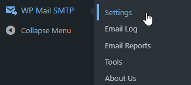
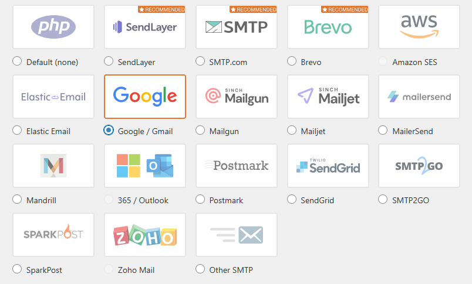
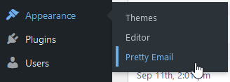
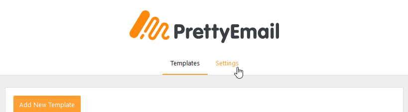
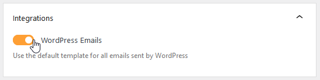
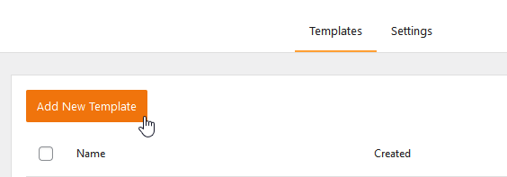
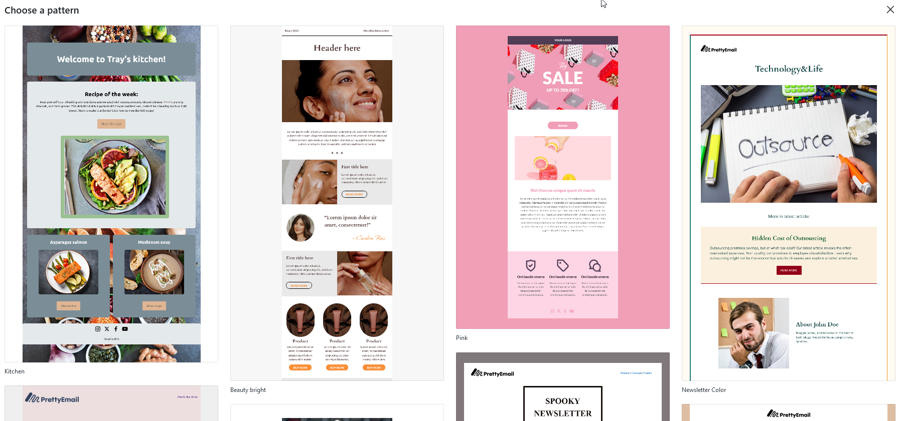
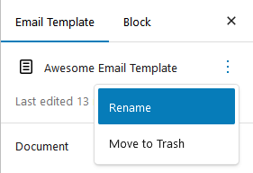
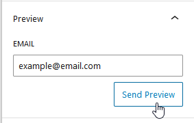
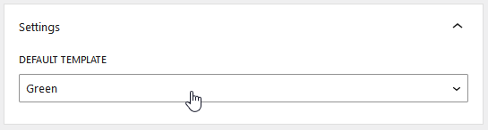

# WP Mail SMTP

**WP Mail SMTP integration with Pretty Email** delivers the best of both worlds: reliable email delivery through professional SMTP services combined with stunning, branded email templates. While WP Mail SMTP ensures your emails reach their destination, Pretty Email guarantees they look professional and engaging when they arrive.

:::tip Perfect Partnership
Configure both plugins in under **7 minutes** to achieve reliable delivery AND beautiful design. Each plugin handles what it does best!
:::

## How They Work Together

**WP Mail SMTP** and **Pretty Email** serve complementary purposes in your WordPress email infrastructure:

- **WP Mail SMTP**: Manages email delivery through reliable SMTP providers (Gmail, SendGrid, Mailgun, etc.)
- **Pretty Email**: Handles email design and template styling for professional appearance

Think of it this way: WP Mail SMTP is your postal service, ensuring emails get delivered. Pretty Email is your designer, making sure they look amazing when they arrive.

:::info Why Use Both?
Using both plugins together gives you:
- **Professional branding** - Custom templates build trust and reinforce your brand identity with every message
- **Reliable delivery** - SMTP providers bypass hosting server limitations and ensure emails reach inboxes
- **Enhanced authentication** - SMTP services provide proper SPF/DKIM setup that improves sender reputation
- **Higher engagement** - Beautiful, well-designed emails improve click-through rates and user response
:::

## Prerequisites

Before setting up this powerful combination, ensure you have:

- **WP Mail SMTP plugin** installed and configured with your SMTP provider
- **Pretty Email plugin** installed and active ([Installation Instructions](../installation-and-license.md))
- WordPress 5.0+ with PHP 7.4 or newer recommended
- Active SMTP service credentials (Gmail, SendGrid, Mailgun, Amazon SES, or similar)
- Basic understanding of SMTP configuration

:::info Getting Started
[Download Pretty Email](https://bracketspace.com/downloads/pretty-email/) to enhance your email design, and pair it with [WP Mail SMTP](https://wordpress.org/plugins/wp-mail-smtp/) for reliable delivery.
:::

## Step-by-Step Setup Guide

### 1. Configure WP Mail SMTP First

Ensure WP Mail SMTP is properly set up before adding Pretty Email templates:

1. Navigate to **WP Mail SMTP** → **Settings**

    

2. Select your preferred **SMTP provider** (Gmail, SendGrid, Mailgun, etc.)

    

3. Configure your SMTP credentials and authentication settings
4. Send a **test email** to verify delivery is working

:::warning SMTP Setup Required
Pretty Email templates won't help if emails aren't being delivered. Always configure and test WP Mail SMTP before proceeding with template design.
:::

### 2. Enable Pretty Email for WordPress System Emails

Activate Pretty Email to style the emails that WP Mail SMTP will deliver:

1. Go to **Appearance** → **Pretty Email**

    

2. Click the **Settings** tab

    

3. Enable **WordPress Emails** under Integrations

    

### 3. Design Your Email Template

Create or customize templates that will be delivered via your SMTP provider:

1. In Pretty Email, click **Add New Template**

    

2. Choose from preset designs or build from scratch

    

3. Add essential components to your design:
   - Start with a **Section** block for layout structure
   - Include an **Email Body** block to display email content
   - Add branding elements (logo, header, footer)
   - Customize colors, fonts, and spacing to match your brand

4. Name your template descriptively in the Settings panel

    

5. Send a test email to verify appearance

    

:::note Email Body Block Required
Your template **must include an Email Body block** to display the actual email content. Without this block, only your template wrapper will appear.
:::

:::tip Design Resources
Review [Creating New Templates](../composing-templates/creating-new-template.md) and [Block Composition Guide](../composing-templates/composing-templates-with-blocks.md) for detailed template building instructions.
:::

### 4. Select Your Default Template

Choose which template will wrap your emails before SMTP delivery:

1. In the **Settings** tab, locate **Default Template** dropdown
2. Select your preferred template from available options

    

:::note Template Requirements
Confirm your chosen template contains an **Email Body block** to preserve the original email message content.
:::

### 5. Test the Complete Integration

Verify both plugins are working together seamlessly:

1. Trigger a WordPress email (password reset, comment notification, etc.)
2. Check your inbox for the delivered message
3. Verify the email uses your Pretty Email template design
4. Confirm all dynamic content displays correctly
5. Check email headers show proper SMTP routing

:::tip Testing Best Practices
Test multiple email types (user registration, password reset, admin notifications) to ensure consistent template application across different WordPress email triggers.
:::

## Configuration Options

### SMTP Provider Recommendations

Different SMTP providers work excellently with Pretty Email templates:

**For Small to Medium Sites:**
- **Gmail SMTP**: Free tier, easy setup, reliable for low volume
- **Brevo (Sendinblue)**: Free tier includes 300 emails/day with good deliverability
- **SendLayer**: WordPress-focused SMTP with excellent support

**For High-Volume Sites:**
- **SendGrid**: Robust delivery infrastructure, detailed analytics
- **Mailgun**: Developer-friendly with powerful API
- **Amazon SES**: Cost-effective for large volumes with AWS integration
- **SparkPost**: Enterprise-grade delivery with comprehensive tracking

:::info Provider Compatibility
Pretty Email works with **all SMTP providers** supported by WP Mail SMTP. The template design is applied before handoff to the SMTP service.
:::

### Template Customization

Enhance your email appearance to maximize impact:

- **Brand Identity**: Integrate logos, colors, and typography consistently
- **Call-to-Action**: Add buttons and links that stand out visually
- **Social Proof**: Include social media icons and trust badges
- **Footer Information**: Add contact details, unsubscribe links, legal text

### Template Library

Browse our [template showcase](../composing-templates/creating-new-template.md) for design inspiration:

- Corporate professional layouts
- Modern minimalist styles
- Creative agency designs
- Tech startup aesthetics

## Troubleshooting Common Issues

### Emails Not Being Delivered

**Problem**: Emails aren't reaching recipients despite both plugins being active.

**Solution**:
1. Verify WP Mail SMTP is properly configured with valid credentials
2. Check SMTP provider dashboard for delivery errors or quota limits
3. Send a test email through WP Mail SMTP settings to isolate delivery issues
4. Review email logs in WP Mail SMTP for error messages
5. Confirm sender email address is authorized by your SMTP provider

### Templates Not Applied to Emails

**Problem**: Emails arrive successfully but without Pretty Email styling.

**Solution**:
1. Confirm WordPress Emails integration is enabled in Pretty Email settings
2. Verify default template is selected and saved
3. Ensure your template includes the Email Body block
4. Check that emails are sent as plain text (HTML emails bypass templates)
5. Clear WordPress cache and object cache if applicable

### Broken Template Layout

**Problem**: Email design appears distorted or elements are misaligned.

**Solution**:
1. Test templates across multiple email clients (Gmail, Outlook, Apple Mail)
2. Simplify complex layouts for better email client compatibility
3. Use standard web fonts supported across platforms
4. Avoid CSS properties that email clients commonly strip
5. Preview templates before deploying to production

### SMTP Errors After Pretty Email Installation

**Problem**: WP Mail SMTP reports errors after enabling Pretty Email.

**Solution**:
1. Verify Pretty Email isn't conflicting with other email plugins
2. Check WP Mail SMTP debug logs for specific error messages
3. Temporarily disable Pretty Email to isolate the issue source
4. Update both plugins to latest versions for compatibility
5. Contact support if errors persist with detailed error logs

## Frequently Asked Questions

**Q: Will Pretty Email slow down my WP Mail SMTP delivery?**

A: Pretty Email adds minimal processing overhead (typically milliseconds) to wrap email content in templates. The actual sending speed depends entirely on your SMTP provider's infrastructure and connection quality.

**Q: Can I use different templates for different types of WordPress emails?**

A: With the WordPress integration, one default template applies to all WordPress system emails. For granular per-email-type templates, consider plugin-specific integrations like [Gravity Forms](gravity-forms.md) or [WooCommerce](woocommerce.md).

**Q: Does Pretty Email work with all WP Mail SMTP providers?**

A: Yes! Pretty Email applies templates before WP Mail SMTP handles delivery, so it's compatible with all supported providers including Gmail, SendGrid, Mailgun, Amazon SES, Brevo, SparkPost, and others.

**Q: Will my SMTP provider's tracking pixels still work?**

A: Absolutely. Pretty Email wraps your content without interfering with tracking pixels, analytics codes, or open tracking that your SMTP provider injects into emails.

**Q: Can I preview how templates will look before emails are sent via SMTP?**

A: Yes, use the preview function in the Pretty Email editor. For complete testing with actual SMTP delivery, send test emails through WP Mail SMTP's test functionality.

**Q: Do Pretty Email templates affect email authentication (SPF, DKIM)?**

A: No. Email authentication is handled entirely by WP Mail SMTP and your SMTP provider. Pretty Email only modifies the HTML content, not email headers or authentication mechanisms.

**Q: What happens if my SMTP quota is exceeded?**

A: SMTP quota limits are controlled by your provider and WP Mail SMTP. Pretty Email will continue applying templates to emails, but delivery will fail based on your SMTP provider's restrictions.

## Related Resources

### Other Integration Guides
- [WordPress Core Emails](wordpress.md) - System email template configuration
- [Contact Form 7 Integration](contact-form-7.md) - Form notification styling
- [WooCommerce Templates](woocommerce.md) - E-commerce order email customization

### Email Design Guides
- [Template Creation Tutorial](../composing-templates/creating-new-template.md) - Build custom email layouts
- [Block Reference Guide](../composing-templates/composing-templates-with-blocks.md) - Master template building blocks
- [Global Settings Configuration](../composing-templates/global-template-settings/index.md) - Site-wide brand consistency

### Support and Help
Need assistance configuring WP Mail SMTP with Pretty Email? [Contact our support team](mailto:support@bracketspace.com) for expert guidance on optimizing your email delivery and design setup.

:::tip Deliverability Best Practice
Pair reliable SMTP delivery with professional email design for maximum impact. Even the most beautiful template won't help if emails land in spam - prioritize deliverability first, then enhance with design.
:::
