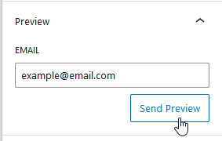

# WPForms Lite

**WPForms Lite email customization** with Pretty Email elevates your basic form notifications into polished, branded messages that strengthen credibility and enhance user response. While WPForms Lite defaults to plain text notifications, Pretty Email empowers you to design attractive email templates that reinforce your brand identity and boost conversion.

:::tip Rapid Configuration
Enhance your WPForms notifications in approximately **8 minutes** using our comprehensive walkthrough below. Technical skills not required!
:::

## Prerequisites

Before linking Pretty Email with WPForms Lite, confirm you have:

- **WPForms Lite plugin** installed and operational on your WordPress website
- **Pretty Email plugin** installed and active ([Setup Instructions](../installation-and-license.md))
- WordPress 5.0 minimum with PHP 7.4 or newer
- At least one form built and published in WPForms

:::info New to Pretty Email?
[Get Pretty Email](https://bracketspace.com/downloads/pretty-email/) and start crafting professional email designs right away.
:::

## Step-by-Step Integration Guide

### 1. Activate Pretty Email for WordPress System Emails

Start by enabling Pretty Email to manage WordPress core emails (which encompasses WPForms Lite):

1. Navigate to **Appearance** → **Pretty Email**

    

2. Select the **Settings** tab

    

3. Activate **WordPress Emails** in the Integrations section

    

### 2. Build a Custom Template

Craft a personalized email template for your WPForms Lite notifications:

1. In Pretty Email, select **Add New Template**

    

2. Pick from ready-made preset templates or start with a blank canvas

    

3. Incorporate key components into your template:
   - Begin with a **Section** block to establish your layout framework
   - Place an **Email Body** block where form response data should display
   - Include brand assets like logos, headers, and footers
   - Adjust colors, typefaces, and margins to reflect your brand

4. Label your template in the Settings panel for quick reference

    

5. Dispatch a test message to confirm the appearance in your email application

    

:::note Email Body Block Essential
Your template **must contain an Email Body block** to render the WPForms Lite submission information. Omitting this block prevents form data from appearing in emails.
:::

:::tip Additional Resources
Consult [Creating New Templates](../composing-templates/creating-new-template.md) and [Composing Templates with Blocks](../composing-templates/composing-templates-with-blocks.md) for comprehensive template construction guidance.
:::

### 3. Designate Your Primary Email Template

Select the template that will style your WPForms notifications:

1. Within the **Settings** tab, locate the **Default Template** menu
2. Choose your preferred email template from available options

    

:::note Email Body Block Essential
Verify your selected template incorporates an **Email Body block** to present the form submission information.
:::

### 4. Configure Your WPForms Settings

Adjust your WPForms for optimal Pretty Email integration:

1. Access **WPForms** → **All Forms** from the navigation menu

    

2. Modify an existing form or generate a new one
3. Open **Settings** → **Notifications** in the form editor

    

4. Verify notification parameters include accurate recipient addresses
5. Confirm **Enable Notifications** is activated

    

6. In the **Email Template** dropdown, select **Plain Text** format

    

:::tip Field Label Best Practice
Implement descriptive labels for form fields to improve email clarity. Thoughtful labeling produces well-organized, professional notification messages.
:::

### 5. Validate Your Integration

Always conduct thorough testing before launching:

1. Complete a test submission via your website form
2. Inspect your email inbox for the styled notification
3. Verify all submitted information appears correctly
4. Examine display quality on both desktop and mobile email platforms

## Customization Options

### Visual Identity Alignment

Harmonize your email appearance with brand standards:

- **Header Imagery**: Display your company logo prominently at the top
- **Color Coordination**: Mirror your website's color scheme for brand consistency
- **Typography Consistency**: Employ matching fonts throughout all communications
- **Layout Variations**: Choose from multiple template architectures
- **Footer Components**: Add social media icons and contact details

### Template Collection

Explore our [template showcase](../composing-templates/creating-new-template.md) for inspiration and pre-designed options:

- Business professional layouts
- Creative boutique aesthetics
- Service-oriented designs
- Modern minimalist styles

## Troubleshooting Common Issues

### Notifications Not Arriving

**Problem**: Form submissions complete but notification emails fail to deliver.

**Solution**:
1. Review WPForms notification settings for correct configuration
2. Verify your hosting service permits outbound email transmission
3. Install an SMTP solution like WP Mail SMTP to improve delivery reliability
4. Test delivery to an alternate email address
5. Check spam and junk folders carefully

### Templates Not Rendering

**Problem**: Notification emails continue appearing as unformatted plain text.

**Solution**:
1. Confirm WordPress Emails integration is enabled in Pretty Email
2. Verify default template selection is properly saved
3. Ensure your chosen template contains the Email Body block
4. Check that WPForms sends plain text format (HTML formatting bypasses templates)
5. Clear all caching plugins and WordPress cache

### Form Data Not Displaying

**Problem**: Notification emails arrive without user-submitted information.

**Solution**:
1. Verify Email Body block is positioned in your template
2. Review WPForms notification settings and smart tag configuration
3. Confirm form field names follow proper conventions
4. Test using a simplified form structure initially

### Design Display Issues

**Problem**: Email template appears distorted or improperly formatted.

**Solution**:
1. Test across multiple email platforms (Gmail, Outlook, Apple Mail, Yahoo) as some clients strip styling
2. Use universally supported fonts and color values
3. Simplify design complexity for improved consistency

### Inconsistent Template Application

**Problem**: Some forms display styling while others remain plain text.

**Solution**:
1. Confirm WordPress Emails integration activation
2. Verify default template assignment is configured
3. Ensure WPForms transmits plain text format
4. Identify conflicts with other email-handling plugins
5. Review individual form notification settings for custom overrides

## Frequently Asked Questions

**Q: Can I apply different templates to individual WPForms?**

A: The WordPress Emails integration presently applies one universal template to all WPForms Lite notifications. For granular per-form template assignment, explore our [Gravity Forms integration](gravity-forms.md) which provides advanced customization.

**Q: Does Pretty Email support WPForms add-ons and extensions?**

A: Pretty Email operates seamlessly with core WPForms Lite functionality and maintains compatibility with most add-ons, as it processes final email output. Extensions that substantially modify email structure should be tested for compatibility.

**Q: Will Pretty Email influence my form notification delivery rates?**

A: Pretty Email enhances visual presentation and professional appeal but functions independently from email delivery infrastructure. To maximize delivery success, combine with dedicated SMTP services like SendGrid, Amazon SES, or Brevo.

**Q: Can I embed images within WPForms notification emails?**

A: Yes! Your Pretty Email template designs support image integration. User-uploaded files from form submissions (available in WPForms Pro) follow your existing WPForms processing configuration.

**Q: How can I preview notifications before activating on live forms?**

A: Template preview capability exists within the Pretty Email editor. For comprehensive end-to-end testing with actual form data, submit test entries through your website to evaluate complete notification rendering.

**Q: Does Pretty Email work with both free and premium WPForms versions?**

A: Absolutely! Pretty Email maintains full compatibility with WPForms Lite (free edition) and WPForms Pro (premium edition). Integration steps remain identical across both versions.

## Related Resources

### Additional Form Integration Guides
- [Contact Form 7 Styling](contact-form-7.md) - Popular contact form email enhancement
- [Gravity Forms Design Options](gravity-forms.md) - Advanced form builder customization
- [WooCommerce Order Emails](woocommerce.md) - E-commerce transactional email templates
- [WordPress Core Emails](wordpress.md) - System notification customization

### Email Design Resources
- [Template Creation Walkthrough](../composing-templates/creating-new-template.md) - Build personalized email layouts
- [Block Component Guide](../composing-templates/composing-templates-with-blocks.md) - Master email building elements
- [Universal Configuration](../composing-templates/global-template-settings/index.md) - Maintain brand consistency site-wide

### Support Access
Need assistance with WPForms integration? [Connect with our support specialists](mailto:support@bracketspace.com) for personalized guidance on email template configuration.

:::tip Best Practice
Maintain streamlined form structures for optimal notification clarity. Lengthy forms with numerous fields create dense email content regardless of template quality. Consider multi-step forms for improved user experience and notification readability.
:::
